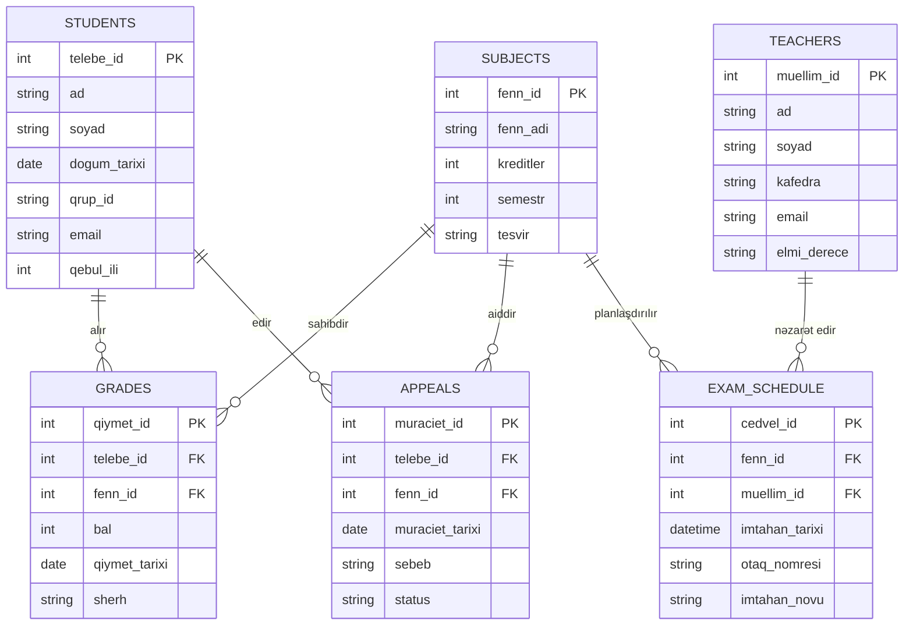
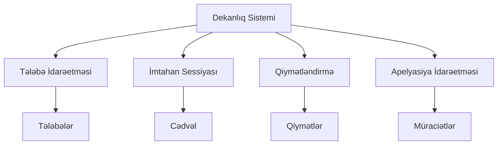
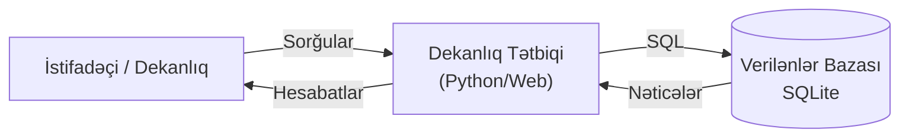
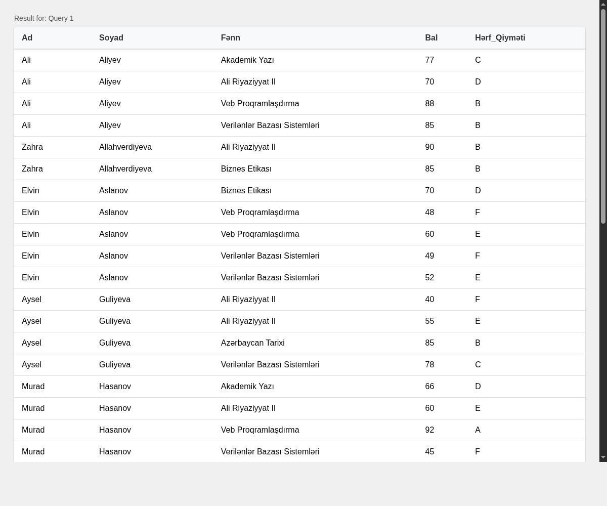
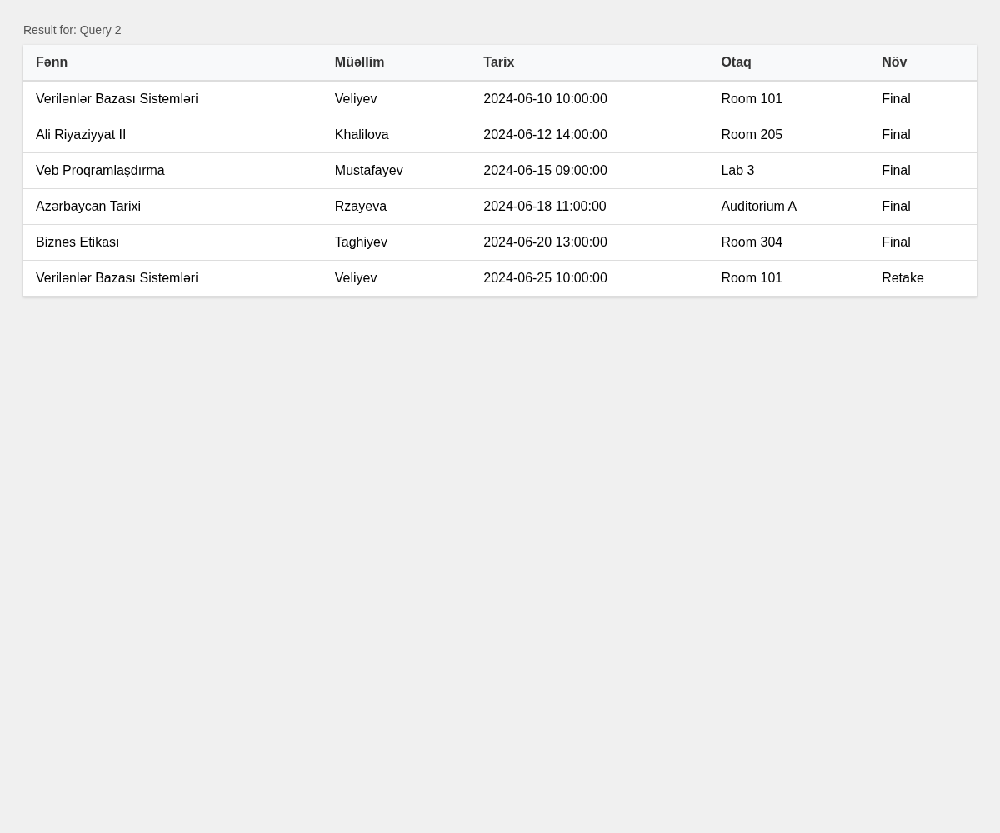
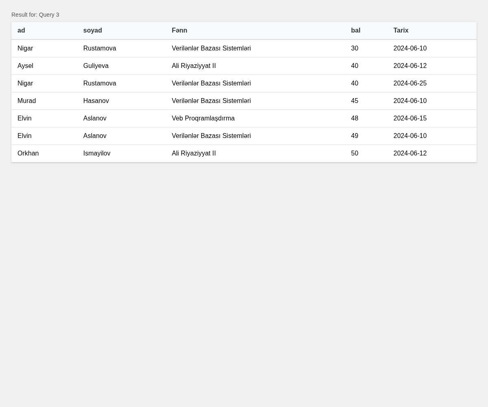
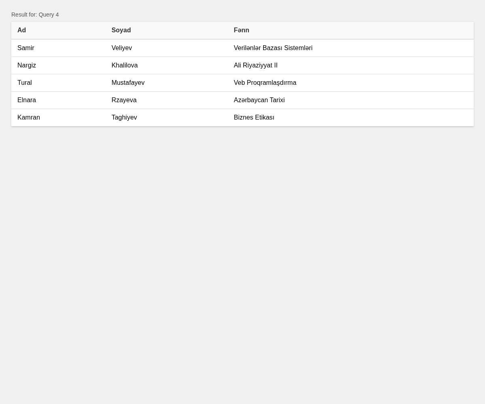
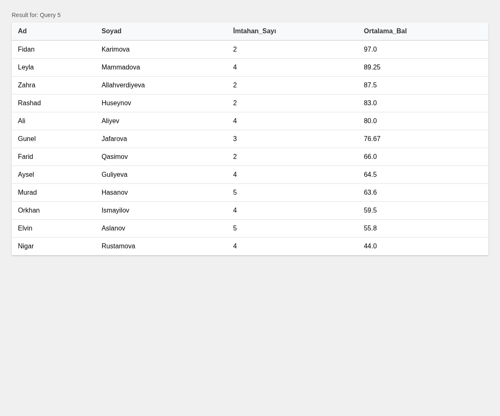

<div align="center">

<!-- University Logo will go here -->


**AZƏRBAYCAN DÖVLƏT NEFT VƏ SƏNAYE UNİVERSİTETİ**

</div>

---

<div align="center">

### KURS İŞİ

**Dekanlıqda Sessiya Dövründə Fəaliyyətlərin Təşkili**

</div>

---

**Tələbənin adı, soyadı:** ___________________________

**Qrup:** ___________________________

**Fakultə:** ___________________________

**Kafedra:** ___________________________

**Fənn:** Verilənlər Bazası Sistemləri

**Kurs işinin mövzusu:** Dekanlıqda Sessiya Dövründə Fəaliyyətlərin Təşkili

---

**Kurs işinin müdafiəsində iştirak edən kafedranın professor-müəllim heyətinin tərkibi:**

| Qrup | Tələbə | Rəhbər | İmza |
|------|---------|---------|------|
| _____ | _______________ | _______________ | _____ |
| _____ | _______________ | _______________ | _____ |
| _____ | _______________ | _______________ | _____ |

**Kurs işinin rəhbəri:** ___________________________

**İmza:** ___________  **Tarix:** ___ / ___ / 2025

---

# Xülasə

Bu kurs işi universitet dekanlığında sessiya dövründə fəaliyyətlərin idarə olunması üçün əlaqəli verilənlər bazası sisteminin layihələndirilməsi və tətbiqinə həsr olunmuşdur. Sistemin məqsədi tələbə qeydiyyatı, qiymətlərin yazılması, imtahan cədvəlinin tərtib edilməsi və akademik apelyasiyaların idarə edilməsi kimi kritik prosesləri avtomatlaşdırmaq və sadələşdirməkdir. Layihə mövzu sahəsinin təhlili və konseptual modelləşdirmədən başlayaraq, verilənlər bazasının normallaşdırılması, SQL implementasiyası və sorğuların optimallaşdırılmasına qədər tam inkişaf dövrünü əhatə edir. Yekun nəticə dekanlığın operativ tələblərini dəstəkləyən funksional verilənlər bazası sxemi və məlumatların idarə edilməsi üçün SQL skriptlər daxil olmaqla tam bir paketdir.

---

# Giriş

Dekanlıq tələbələrin akademik həyat dövrünə cavabdeh olan istənilən universitet fakültəsinin inzibati mərkəzidir. Akademik təqvimdə ən vacib və məlumat tutumlu dövrlərdən biri imtahan sessiyasıdır. Bu müddət ərzində cədvəllər, qiymətlər, təkrar imtahanlar və apelyasiyalarla bağlı məlumatların həcmi əhəmiyyətli dərəcədə artır. Bu məlumatların kağız jurnallar və ya əlaqəsiz elektron cədvəllər vasitəsilə əl ilə idarə olunması səhvlərə, səmərəsizliyə və məlumat uyğunsuzluğuna səbəb ola bilər.

Bu layihənin məqsədi imtahan sessiyası zamanı dekanlığın ehtiyaclarına xidmət edən mərkəzləşdirilmiş verilənlər bazası sistemi layihələndirməkdir. Sistem məlumatların bütövlüyünü qorumalı, akademik qaydaları (məsələn, qiymətlərin etibarlılığı və cədvəl toqquşmalarının olmaması) tətbiq etməli və iştirakçılara (tələbələr, müəllimlər və inzibatçılar) vaxtında məlumat verməlidir.

Layihənin əhatə dairəsi:
1. **Təhlil**: Əsas obyektlərin və əlaqələrin müəyyən edilməsi.
2. **Dizayn**: ER diaqramlarının yaradılması və sxemin Üçüncü Normal Formaya (3NF) qədər normallaşdırılması.
3. **İmplementasiya**: Cədvəllərin yaradılması və nümunə məlumatlarla doldurulması üçün SQL skriptlərinin yazılması.
4. **Tətbiq**: Sistemin imkanlarının müxtəlif SQL sorğuları vasitəsilə nümayiş etdirilməsi.

---

# Fəsil I – Mövzu Sahəsinin Təhlili və Konseptual Model

## 1.1 Sessiyanın İdarə Edilməsində Dekanlığın Rolu
"Sessiya dövru" çoxsaylı resursların əlaqələndirilməsini əhatə edir: tələbələr, müəllimlər, auditoriyalar və vaxt intervalları. Sistem aşağıdakıları izləməlidir:
* Hansı tələbələrin imtahan vermək hüququ var.
* İmtahanların nə vaxt və harada keçirildiyi.
* Bu imtahanların nəticələri (qiymətlər).
* Kəsilən və ya qiymətlə razılaşmayan tələbələr üçün düzəldici tədbirlər (təkrar imtahanlar və apelyasiyalar).

## 1.2 Obyektlərin Müəyyən Edilməsi
Təhlilə əsasən aşağıdakı əsas obyektlər müəyyən edilmişdir:

1. **STUDENTS** (Tələbələr): İmtahan verən şəxslər.
2. **TEACHERS** (Müəllimlər): İmtahan keçirən və qiymətləndirən akademik heyət.
3. **SUBJECTS** (Fənlər): İmtahan olunan kurslar.
4. **EXAM_SCHEDULE** (İmtahan Cədvəli): İmtahanların vaxtı və yeri barədə logistik detallar.
5. **GRADES** (Qiymətlər): Tələbələrin konkret fənlər üzrə göstəriciləri.
6. **APPEALS** (Apelyasiyalar): Qiymətin yenidən baxılması üçün tələbələrin rəsmi müraciətləri.

## 1.3 Hər Bir Obyektin Atributları
* **STUDENTS**: `telebe_id` (PK), `ad`, `soyad`, `dogum_tarixi`, `qrup_id`, `email`, `qebul_ili`.
* **TEACHERS**: `muellim_id` (PK), `ad`, `soyad`, `kafedra`, `email`, `elmi_derece`.
* **SUBJECTS**: `fenn_id` (PK), `fenn_adi`, `kreditler`, `semestr`, `tesvir`.
* **EXAM_SCHEDULE**: `cedvel_id` (PK), `fenn_id` (FK), `muellim_id` (FK), `imtahan_tarixi`, `otaq_nomresi`, `imtahan_novu`.
* **GRADES**: `qiymet_id` (PK), `telebe_id` (FK), `fenn_id` (FK), `bal`, `qiymet_tarixi`, `sherh`.
* **APPEALS**: `muraciet_id` (PK), `telebe_id` (FK), `fenn_id` (FK), `muraciet_tarixi`, `sebeb`, `status`.

## 1.4 ER Diaqramı
Aşağıdakı Obyekt-Əlaqə (ER) diaqramı bu obyektlər arasındakı əlaqələri təsvir edir. Bir-çox əlaqələrə diqqət yetirin (məsələn, bir müəllim bir çox cədvəl girişi yaradır; bir tələbənin bir çox qiyməti var).



## 1.5 Konseptual Model Diaqramı
Konseptual model müxtəlif funksional sahələri əlaqələndirən Dekanlıq Sistemini mərkəzə qoyur.



## 1.6 Normallaşdırma
Məlumat təkrarını minimuma endirmək və bütövlüyü qorumaq üçün verilənlər bazası normallaşdırılmışdır.

* **Birinci Normal Forma (1NF)**: Bütün sütunlar atomar dəyərlərdən ibarətdir. Biz qiymətlər siyahısını bir xanada saxlamırıq; bunun əvəzinə ayrı `GRADES` cədvəlindən istifadə edirik.
* **İkinci Normal Forma (2NF)**: Bütün açar olmayan atributlar əsas açardan tam asılıdır. Məsələn, `subject_name` yalnız `subject_id`-dən asılıdır, onu götürən tələbədən yox.
* **Üçüncü Normal Forma (3NF)**: Tranzitiv asılılıqlar aradan qaldırılmışdır. Biz `EXAM_SCHEDULE` cədvəlində `teacher_name` saxlamırıq; `teacher_id` saxlayırıq və `TEACHERS` cədvəlinə istinad edirik.

## 1.7 Funksional Tələblər
Sistem aşağıdakıları dəstəkləməlidir:
* Yeni tələbə və müəllimlərin qeydiyyatı.
* Otaq münaqişələri olmadan imtahanların planlaşdırılması.
* Rəqəmsal balların (0-100) daxil edilməsi.
* Təkrar imtahanların planlaşdırılması üçün kəsilən tələbələrin siyahısının alınması.
* Qiymət apelyasiyalarının statusunun izlənməsi.

---

# Fəsil II – Verilənlər Bazasının Layihələndirilməsi və İmplementasiyası

## 2.1 Verilənlər Bazası Sxemi
Fiziki implementasiya standart SQL istifadə edərək həyata keçirilmişdir. Unikallıq üçün Əsas Açarlardan (PK) və cədvəllər arasında istinad bütövlüyünü təmin etmək üçün Xarici Açarlardan (FK) istifadə edirik.

## 2.2 SQL: CREATE TABLE Skriptləri
Struktur `create_tables.sql` faylında müəyyən edilmişdir.

```sql
CREATE TABLE STUDENTS (
    telebe_id INT PRIMARY KEY,
    ad VARCHAR(50) NOT NULL,
    soyad VARCHAR(50) NOT NULL,
    dogum_tarixi DATE,
    qrup_id VARCHAR(10) NOT NULL,
    email VARCHAR(100) UNIQUE,
    qebul_ili INT
);

CREATE TABLE GRADES (
    qiymet_id INT PRIMARY KEY,
    telebe_id INT,
    fenn_id INT,
    bal INT CHECK (bal >= 0 AND bal <= 100),
    qiymet_tarixi DATE,
    sherh TEXT,
    FOREIGN KEY (telebe_id) REFERENCES STUDENTS(telebe_id),
    FOREIGN KEY (fenn_id) REFERENCES SUBJECTS(fenn_id)
);
```

## 2.3 SQL: Test Məlumatlarının Daxil Edilməsi (INSERT)
Bütün funksionallıqları yoxlamaq üçün verilənlər bazasını reprezentativ məlumat dəsti ilə doldurmuşuq.

```sql
INSERT INTO STUDENTS (telebe_id, ad, soyad, dogum_tarixi, qrup_id, email, qebul_ili) VALUES
(101, 'Əli', 'Əliyev', '2003-05-15', 'CS-2101', 'ali.aliyev@uni.edu', 2021),
(102, 'Leyla', 'Məmmədova', '2004-02-20', 'CS-2101', 'leyla.m@uni.edu', 2021);

INSERT INTO GRADES (qiymet_id, telebe_id, fenn_id, bal, qiymet_tarixi, sherh) VALUES
(1, 101, 10, 85, '2024-06-10', 'Yaxşı iş'),
(3, 103, 10, 45, '2024-06-10', 'Kəsildi');
```

## 2.4 Açar və Əlaqələrin İzahı
* **PK (Əsas Açar)**: Unikal qeydi müəyyən edir (məsələn, `telebe_id`).
* **FK (Xarici Açar)**: Cədvəlləri əlaqələndirir. `GRADES.telebe_id` qiyməti `STUDENTS` cədvəlindəki konkret tələbə ilə əlaqələndirir. Bu mövcud olmayan tələbəyə qiymət yazılmasının qarşısını alır.
* **Məhdudiyyətlər**: `CHECK (bal >= 0 AND bal <= 100)` verilənlər bazası səviyyəsində qiymətin etibarlılığını təmin edir.

## 2.5 Sistem Arxitekturası Diaqramı
Aşağıdakı diaqram verilənlər bazasının daha geniş tətbiq arxitekturasına necə inteqrasiya olunduğunu göstərir.



---

# Fəsil III – İstifadəçi Sorğuları və İzahı

Bu fəsil ümumi dekanlıq suallarına cavab vermək üçün hazırlanmış SQL sorğuları vasitəsilə verilənlər bazasının praktiki faydalılığını nümayiş etdirir.

## 3.1 Sorğu 1 – Qiymətləri Olan Bütün Tələbələrin Siyahısı
Bu sorğu oxunaqlı bir transkript təmin etmək üçün `STUDENTS`, `GRADES` və `SUBJECTS` cədvəllərini birləşdirir. Həmçinin bala əsasən hərf qiymətini dinamik olaraq hesablayır.

```sql
SELECT 
    s.ad, 
    s.soyad, 
    subj.fenn_adi AS Fənn, 
    g.bal,
    CASE 
        WHEN g.bal >= 91 THEN 'A'
        WHEN g.bal >= 81 THEN 'B'
        WHEN g.bal >= 71 THEN 'C'
        WHEN g.bal >= 61 THEN 'D'
        WHEN g.bal >= 51 THEN 'E'
        ELSE 'F' 
    END AS Hərf_Qiyməti
FROM GRADES g
JOIN STUDENTS s ON g.telebe_id = s.telebe_id
JOIN SUBJECTS subj ON g.fenn_id = subj.fenn_id
ORDER BY s.soyad, subj.fenn_adi;
```

**Nəticə:**


## 3.2 Sorğu 2 – İmtahan Cədvəli
İmtahanların kim tərəfindən, harada və nə vaxt keçirildiyini göstərərək administrasiyaya logistikanı təşkil etməyə kömək edir.

```sql
SELECT 
    subj.fenn_adi AS Fənn,
    t.soyad AS Müəllim,
    es.imtahan_tarixi AS Tarix,
    es.otaq_nomresi AS Otaq,
    es.imtahan_novu AS Növ
FROM EXAM_SCHEDULE es
JOIN SUBJECTS subj ON es.fenn_id = subj.fenn_id
JOIN TEACHERS t ON es.muellim_id = t.muellim_id
ORDER BY es.imtahan_tarixi;
```

**Nəticə:**


## 3.3 Sorğu 3 – Kəsilən Tələbələr (<51)
Bu "Kəsir Sessiyası" üçün çox vacibdir. 51-dən aşağı balları süzgəcdən keçirir.

```sql
SELECT 
    s.ad, 
    s.soyad, 
    subj.fenn_adi AS Fənn, 
    g.bal,
    g.qiymet_tarixi AS Tarix
FROM GRADES g
JOIN STUDENTS s ON g.telebe_id = s.telebe_id
JOIN SUBJECTS subj ON g.fenn_id = subj.fenn_id
WHERE g.bal < 51
ORDER BY g.bal ASC;
```

**Nəticə:**


## 3.4 Sorğu 4 – Müəllim üzrə Fənlər
Tədris yüklərini görmək üçün sadə aqreqasiya və ya unikal seçim.

```sql
SELECT DISTINCT
    t.ad,
    t.soyad,
    subj.fenn_adi AS Fənn
FROM EXAM_SCHEDULE es
JOIN TEACHERS t ON es.muellim_id = t.muellim_id
JOIN SUBJECTS subj ON es.fenn_id = subj.fenn_id;
```

**Nəticə:**


## 3.5 Sorğu 5 – Yekun Qiymət Hesablaması
Tələbənin bütün fənlər üzrə göstəricilərini müəyyən etmək üçün `AVG()` funksiyasından istifadə edir.

```sql
SELECT 
    s.ad, 
    s.soyad, 
    COUNT(g.qiymet_id) AS İmtahan_Sayı,
    ROUND(AVG(g.bal), 2) AS Ortalama_Bal
FROM STUDENTS s
LEFT JOIN GRADES g ON s.telebe_id = g.telebe_id
GROUP BY s.telebe_id, s.ad, s.soyad
HAVING COUNT(g.qiymet_id) > 0
ORDER BY Ortalama_Bal DESC;
```

**Nəticə:**


## 3.6 Sorğu 6 – Apelyasiyalar
Qiymət mübahisələrinin iş axınını izləyir.

```sql
SELECT 
    a.muraciet_id,
    s.soyad AS Tələbə,
    subj.fenn_adi AS Fənn,
    a.sebeb AS Səbəb,
    a.status AS Status
FROM APPEALS a
JOIN STUDENTS s ON a.telebe_id = s.telebe_id
JOIN SUBJECTS subj ON a.fenn_id = subj.fenn_id;
```

**Nəticə:**


---

# Nəticə

Dekanlıq Verilənlər Bazası Sisteminin işlənib hazırlanması layihənin qarşıya qoyduğu məqsədlərə uğurla nail olmuşdur. Əl ilə idarəetmədən əlaqəli verilənlər bazası modelinə keçməklə biz aşağıdakılara nail olduq:

1. **Məlumat Bütövlüyü**: Məhdudiyyətlər və tiplər yanlış məlumatların daxil edilməsinin qarşısını alır.
2. **Səmərəlilik**: Əvvəllər saatlar çəkən sorğular indi millisaniyələr ərzində icra olunur.
3. **İzlənilə bilənlik**: Hər bir qiymət və apelyasiya qeydə alınır və konkret istifadəçilərlə əlaqələndirilir.

Bu layihə möhkəm bir təməl rolunu oynayır. Gələcək təkmilləşdirmələrə avtomatik ÜOMG (GPA) yeniləmələri üçün saxlanılan prosedurlar qatının əlavə edilməsi, veb əsaslı interfeys (arxitektura diaqramında işarə edildiyi kimi) və qiymətləri yalnız müəllimlərin dəyişə bilməsini təmin etmək üçün rollara əsaslanan giriş nəzarəti (RBAC) daxil ola bilər.

---
