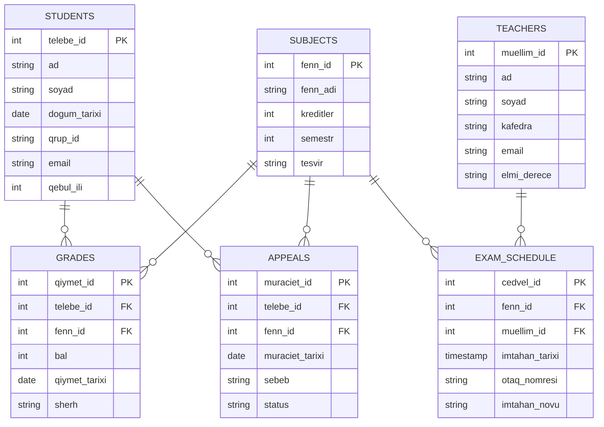
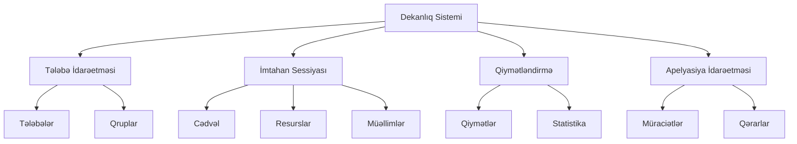
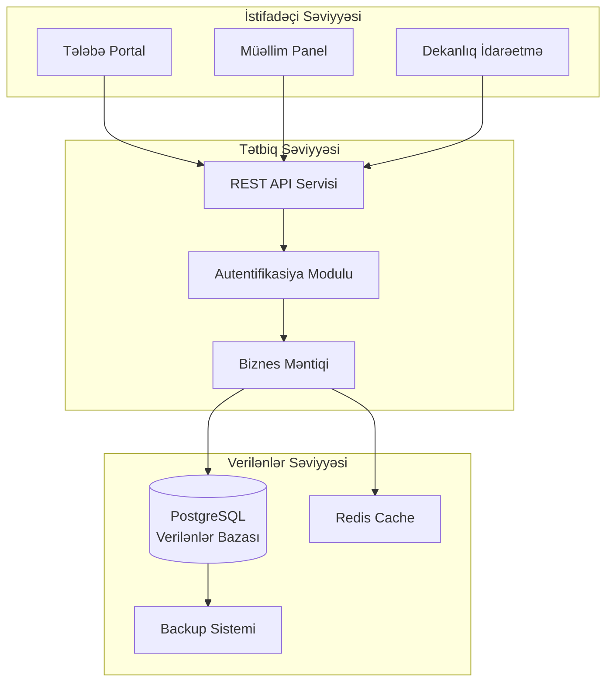

<div align="center">  </div>

----------

<div align="center">

### KURS İŞİ

**Dekanlıqda Sessiya Dövründə Fəaliyyətlərin Təşkili**

</div>

----------

**Tələbənin adı, soyadı:** ___________________________

**Qrup:** ___________________________

**Fakultə:** ___________________________

**Kafedra:** ___________________________

**Fənn:** Verilənlər Bazası Sistemləri

**Kurs işinin mövzusu:** Dekanlıqda Sessiya Dövründə Fəaliyyətlərin Təşkili


---

**Kurs işinin müdafiəsində iştirak edən kafedranın professor-müəllim heyətinin tərkibi:**

| Qrup | Tələbə | Rəhbər | İmza |
|------|---------|---------|------|
| _____ | _______________ | _______________ | _____ |
| _____ | _______________ | _______________ | _____ |
| _____ | _______________ | _______________ | _____ |

**Kurs işinin rəhbəri:** ___________________________

**İmza:** ___________  **Tarix:** ___ / ___ / 2025

---

# Xülasə

Bu kurs işi universitet dekanlığında sessiya dövründə aparılan fəaliyyətlərin idarə olunması məqsədilə əlaqəli verilənlər bazası sisteminin layihələndirilməsi və praktiki tətbiqinə həsr edilmişdir. Sistemin əsas məqsədi tələbə qeydiyyatı, qiymətləndirmə prosesi, imtahan cədvəllərinin tərtib edilməsi və akademik apelyasiyaların idarəsi kimi mühüm prosesləri avtomatlaşdırmaq və asanlaşdırmaqdır.

Layihə mövzu sahəsinin ətraflı təhlili və konseptual modelləşdirmə mərhələsindən başlayaraq verilənlər bazasının normallaşdırılması, SQL əsaslı implementasiya və sorğuların optimallaşdırılması mərhələlərinə qədər tam inkişaf dövrünü əhatə edir. Son nəticə olaraq dekanlığın gündəlik operativ ehtiyaclarını dəstəkləyən funksional verilənlər bazası sxemi və məlumatların effektiv idarə edilməsi üçün SQL skriptlər dəsti hazırlanmışdır. Sistem həmçinin gələcəkdə genişləndirilə bilən, miqyaslaşdırıla bilən və müasir standartlara uyğun şəkildə qurulmuşdur.

----------

# Giriş

## Layihənin Aktualliği və Əhəmiyyəti

Dekanlıq istənilən universitet fakültəsində tələbələrin akademik həyatının bütün mərhələlərinə nəzarət edən əsas inzibati orqandır. Akademik təqvimdə ən kritik və məlumat tutumlu dövrlərdən biri imtahan sessiyası hesab olunur. Bu müddət ərzində imtahan cədvəlləri, qiymətləndirmə nəticələri, təkrar imtahan təşkilatı və apelyasiya prosesləri ilə bağlı məlumatların həcmi əhəmiyyətli dərəcədə artır.

Müasir universitetlərdə bu məlumatların hələ də əl ilə, kağız jurnallar vasitəsilə və ya əlaqəsiz elektron cədvəllər şəklində aparılması bir sıra ciddi problemlərə səbəb olur. Məlumat itkisi, səhvlər, zaman itkisi, verilənlər arasında uyğunsuzluq və şəffaflığın olmaması bu problemlərin əsas göstəriciləridir. Bu situasiya həm inzibati işçilərə, həm müəllimlərə, həm də tələbələrə mənfi təsir göstərir.

Bu layihənin reallaşdırılması aşağıdakı əsas problemlərin həllinə yönəlmişdir:

-   **Məlumat təhlükəsizliyi və bütövlüyü:** Kağız üzərində və ya ayrı-ayrı fayllarda saxlanılan məlumatlar asanlıqla itə və ya dəyişdirilə bilər.
-   **Vaxt səmərəliliyi:** Əl ilə axtarış və hesablama prosesləri çox vaxt aparır.
-   **Şəffaflıq:** Tələbələr öz akademik göstəriciləri barədə vaxtında məlumat ala bilmir.
-   **Hesabatlama:** İnzibatçılar üçün statistik hesabatların hazırlanması çətinlik törədir.

## Layihənin Məqsəd və Vəzifələri

Bu layihənin əsas məqsədi imtahan sessiyası zamanı dekanlığın bütün ehtiyaclarını ödəyən mərkəzləşdirilmiş, təhlükəsiz və səmərəli verilənlər bazası sistemi yaratmaqdır. Sistem məlumatların bütövlüyünü qorumalı, akademik qaydaları (məsələn, qiymətlərin etibarlılığı, cədvəl toqquşmalarının olmaması) avtomatik tətbiq etməli və bütün maraqlı tərəflərə (tələbələr, müəllimlər, inzibatçılar) vaxtında dəqiq məlumat təqdim etməlidir.

### Əsas vəzifələr:

1.  **Təhlil və Tədqiqat:** Dekanlıq işinin xüsusiyyətlərinin öyrənilməsi, əsas proseslərin müəyyən edilməsi və obyektlər arasında əlaqələrin təsviri.
    
2.  **Konseptual Modelləşdirmə:** Obyekt-Əlaqə (ER) diaqramlarının yaradılması və sistemin ümumi arxitekturasının müəyyənləşdirilməsi.
    
3.  **Məntiqsal Dizayn:** Verilənlər bazası sxeminin hazırlanması və Üçüncü Normal Formaya (3NF) qədər normallaşdırılması.
    
4.  **Fiziki İmplementasiya:** SQL skriptlərinin yazılması, cədvəllərin yaradılması və test məlumatları ilə sistemin yoxlanılması.
    
5.  **Funksional Tətbiq:** Dekanlığın gündəlik ehtiyaclarını qarşılayan SQL sorğularının hazırlanması və sınaqdan keçirilməsi.
    
6.  **Dokumentasiya:** Sistemin tam texniki sənədləşdirilməsi və istifadə qaydalarının hazırlanması.
    

## Layihənin Əhatə Dairəsi

Layihə aşağıdakı əsas modulları əhatə edir:

**Tələbə İdarəetmə Modulu:**

-   Tələbə məlumatlarının qeydiyyatı və saxlanması
-   Qrup üzrə strukturlaşdırma
-   Şəxsi məlumatların idarəsi

**İmtahan Sessiyası İdarəetmə Modulu:**

-   İmtahan cədvəllərinin tərtib edilməsi
-   Auditoriya və vaxt təyinatı
-   Müəllim-fənn əlaqələndirməsi
-   Toqquşmaların avtomatik yoxlanılması

**Qiymətləndirmə Modulu:**

-   Qiymətlərin daxil edilməsi və saxlanması
-   Avtomatik hərf qiymətinə çevrilmə
-   Qiymətləndirmə tarixçəsinin aparılması
-   Ortalama göstəricilərin hesablanması

**Apelyasiya İdarəetmə Modulu:**

-   Müraciətlərin qeydiyyatı
-   Status izləmə sistemi
-   Qərar prosesinin sənədləşdirilməsi

----------

# Fəsil I – Mövzu Sahəsinin Təhlili və Konseptual Model

## 1.1 Sessiyanın İdarə Edilməsində Dekanlığın Rolu və Məsuliyyətləri

Sessiya dövrü universitetin akademik proseslərində xüsusi yer tutur və bir sıra mürəkkəb proseslərin koordinasiyasını tələb edir. Dekanlıq bu dövrdə mərkəzi koordinasiya rolunu oynayır və aşağıdakı əsas vəzifələri yerinə yetirir:

**Planlaşdırma və Təşkilat:**

-   İmtahan cədvəllərinin vaxtında tərtib edilməsi
-   Auditoriya resurslarının optimal bölüşdürülməsi
-   Müəllimlərin tədris yükünün balanslaşdırılması
-   Tələbələr üçün münasib imtahan intervallarının təmin edilməsi

**Nəzarət və İzləmə:**

-   İmtahan proseslərinin nizama uyğun keçirilməsinin təmin edilməsi
-   Qiymətləndirmə nəticələrinin vaxtında qeydə alınması
-   Akademik qaydaların gözlənilməsi
-   Mübahisəli halların operativ həlli

**Məlumat İdarəetməsi:**

-   Tələbə akademik göstəricilərinin sistemli aparılması
-   Statistik məlumatların toplanması və təhlili
-   Yuxarı idarəetmə orqanlarına hesabat verilməsi
-   Arxiv sisteminin formalaşdırılması

Sistem bu geniş spektrli vəzifələrin yerinə yetirilməsini avtomatlaşdırmalı və asanlaşdırmalıdır.

## 1.2 Əsas Obyektlərin Müəyyən Edilməsi və Xarakteristikası

Ətraflı təhlil əsasında sistemdə aşağıdakı əsas obyektlər müəyyən edilmişdir:

### 1. **STUDENTS (Tələbələr)**

Sistemin əsas istifadəçi qruplarından biri olan tələbələr barədə məlumatları saxlayır. Hər bir tələbə unikal identifikasiya nömrəsi ilə müəyyən edilir və konkret qrupa aid edilir.

**Əsas funksiyalar:**

-   Şəxsi məlumatların saxlanması
-   Akademik tarixçənin formalaşdırılması
-   Qrup mənsubiyyətinin müəyyənləşdirilməsi

### 2. **TEACHERS (Müəllimlər)**

Akademik heyət haqqında məlumatları ehtiva edir. Müəllimlər imtahanların keçirilməsi və qiymətləndirmə prosesində əsas iştirakçılardır.

**Əsas funksiyalar:**

-   İmtahan cədvəlləri ilə əlaqələndirmə
-   Fənn təyinatlarının aparılması
-   Elmi dərəcə və kafedra məlumatlarının saxlanması

### 3. **SUBJECTS (Fənlər)**

Tədris planında olan fənlər haqqında məlumatlar. Hər fənn müəyyən kredit dəyərinə və semestrə aiddir.

**Əsas funksiyalar:**

-   Kurikulum strukturunun əks etdirilməsi
-   Kredit sisteminin tətbiqi
-   Fənn-imtahan əlaqələrinin qurulması

### 4. **EXAM_SCHEDULE (İmtahan Cədvəli)**

İmtahanların logistik təşkili ilə bağlı məlumatları saxlayan mərkəzi cədvəl. Bu cədvəl fənlər, müəllimlər, vaxt və məkan resurslarını birləşdirir.

**Əsas funksiyalar:**

-   Zaman və məkan planlaşdırılması
-   Toqquşmaların qarşısının alınması
-   İmtahan növlərinin fərqləndirilməsi (əsas, təkrar, apelyasiya)

### 5. **GRADES (Qiymətlər)**

Tələbələrin akademik göstəricilərini əks etdirən əsas cədvəl. Hər qiymət konkret tələbə, fənn və tarixlə əlaqələndirilir.

**Əsas funksiyalar:**

-   Akademik göstəricilərin qeydiyyatı
-   Qiymətləndirmə tarixçəsinin aparılması
-   Statistik təhlil üçün məlumat bazasının formalaşdırılması

### 6. **APPEALS (Apelyasiyalar)**

Qiymətləndirmə nəticələrinə etiraz prosesini idarə edir. Tələbələrə öz hüquqlarını müdafiə etmək imkanı verir.

**Əsas funksiyalar:**

-   Müraciətlərin qeydiyyatı və izlənməsi
-   Status idarəetməsi
-   Qərar qəbul edilməsi prosesinin sənədləşdirilməsi


## 1.3 Hər Bir Obyektin Ətraflı Atributları və İzahları

### STUDENTS (Tələbələr) Cədvəli

| Atribut | Tip | İzah | Məhdudiyyətlər |
|---------|-----|------|----------------|
| `telebe_id` | INT | Unikal tələbə identifikatoru | PRIMARY KEY |
| `ad` | VARCHAR(50) | Tələbənin adı | NOT NULL |
| `soyad` | VARCHAR(50) | Tələbənin soyadı | NOT NULL |
| `dogum_tarixi` | DATE | Doğum tarixi | - |
| `qrup_id` | VARCHAR(10) | Qrup identifikatoru | NOT NULL |
| `email` | VARCHAR(100) | Elektron poçt ünvanı | UNIQUE |
| `qebul_ili` | INT | Universitetə qəbul ili | - |

### TEACHERS (Müəllimlər) Cədvəli

| Atribut | Tip | İzah | Məhdudiyyətlər |
|---------|-----|------|----------------|
| `muellim_id` | INT | Unikal müəllim identifikatoru | PRIMARY KEY |
| `ad` | VARCHAR(50) | Müəllimin adı | NOT NULL |
| `soyad` | VARCHAR(50) | Müəllimin soyadı | NOT NULL |
| `kafedra` | VARCHAR(100) | Kafedra adı | NOT NULL |
| `email` | VARCHAR(100) | Elektron poçt ünvanı | UNIQUE |
| `elmi_derece` | VARCHAR(50) | Elmi dərəcəsi (dosent, professor) | - |

### SUBJECTS (Fənlər) Cədvəli

| Atribut | Tip | İzah | Məhdudiyyətlər |
|---------|-----|------|----------------|
| `fenn_id` | INT | Unikal fənn identifikatoru | PRIMARY KEY |
| `fenn_adi` | VARCHAR(100) | Fənnin tam adı | NOT NULL |
| `kreditler` | INT | Fənnin kredit dəyəri | CHECK (kreditler > 0) |
| `semestr` | INT | Tədris semestri | CHECK (semestr BETWEEN 1 AND 8) |
| `tesvir` | TEXT | Fənnin qısa təsviri | - |

### EXAM_SCHEDULE (İmtahan Cədvəli) Cədvəli

| Atribut | Tip | İzah | Məhdudiyyətlər |
|---------|-----|------|----------------|
| `cedvel_id` | INT | Unikal cədvəl identifikatoru | PRIMARY KEY |
| `fenn_id` | INT | Fənn identifikatoru | FOREIGN KEY |
| `muellim_id` | INT | Müəllim identifikatoru | FOREIGN KEY |
| `imtahan_tarixi` | TIMESTAMP | İmtahan vaxtı | NOT NULL |
| `otaq_nomresi` | VARCHAR(20) | Auditoriya nömrəsi | NOT NULL |
| `imtahan_novu` | VARCHAR(20) | İmtahan növü (əsas/təkrar) | NOT NULL |

### GRADES (Qiymətlər) Cədvəli

| Atribut | Tip | İzah | Məhdudiyyətlər |
|---------|-----|------|----------------|
| `qiymet_id` | INT | Unikal qiymət identifikatoru | PRIMARY KEY |
| `telebe_id` | INT | Tələbə identifikatoru | FOREIGN KEY |
| `fenn_id` | INT | Fənn identifikatoru | FOREIGN KEY |
| `bal` | INT | 100 ballıq sistemdə qiymət | CHECK (bal BETWEEN 0 AND 100) |
| `qiymet_tarixi` | DATE | Qiymətin qoyulma tarixi | NOT NULL |
| `sherh` | TEXT | Əlavə şərhlər | - |

### APPEALS (Apelyasiyalar) Cədvəli

| Atribut | Tip | İzah | Məhdudiyyətlər |
|---------|-----|------|----------------|
| `muraciet_id` | INT | Unikal müraciət identifikatoru | PRIMARY KEY |
| `telebe_id` | INT | Tələbə identifikatoru | FOREIGN KEY |
| `fenn_id` | INT | Fənn identifikatoru | FOREIGN KEY |
| `muraciet_tarixi` | DATE | Müraciət tarixi | NOT NULL |
| `sebeb` | TEXT | Etiraz səbəbi | NOT NULL |
| `status` | VARCHAR(20) | Hal-hazırda status | NOT NULL |

## 1.4 Obyekt-Əlaqə (ER) Diaqramı

Aşağıdakı ER diaqram sistemdəki obyektlər arasındakı əlaqələri vizual şəkildə təsvir edir. Diaqramda bir-çox əlaqələrinə xüsusi diqqət yetirilib (məsələn, bir müəllim bir çox fənn keçir; bir tələbənin bir çox qiyməti var).



**Əlaqələrin İzahı:**

-   **STUDENTS ↔ GRADES:** Bir tələbə bir çox qiymət ala bilər (1:N əlaqəsi)
-   **SUBJECTS ↔ GRADES:** Bir fənn üzrə çoxlu qiymət mövcud ola bilər (1:N əlaqəsi)
-   **STUDENTS ↔ APPEALS:** Bir tələbə bir neçə apelyasiya edə bilər (1:N əlaqəsi)
-   **SUBJECTS ↔ APPEALS:** Bir fənn üzrə çoxlu apelyasiya ola bilər (1:N əlaqəsi)
-   **TEACHERS ↔ EXAM_SCHEDULE:** Bir müəllim bir neçə imtahan keçirə bilər (1:N əlaqəsi)
-   **SUBJECTS ↔ EXAM_SCHEDULE:** Bir fənn üçün bir neçə imtahan seansı təyin edilə bilər (1:N əlaqəsi)

## 1.5 Konseptual Model və Sistem Arxitekturası

Konseptual model sistemin ümumi strukturunu və əsas komponentlər arasındakı əlaqələri göstərir. Dekanlıq Sistemi mərkəzdə yerləşir və bütün alt sistemləri əlaqələndirir.



## 1.6 Normallaşdırma Prosesi və Əsaslandırılması

Verilənlər bazasının normallaşdırılması məlumat təkrarını aradan qaldırmaq, saxlama effektivliyini artırmaq və məlumat bütövlüyünü qorumaq məqsədilə aparılır. Sistemimiz Üçüncü Normal Formaya (3NF) qədər normallaşdırılmışdır.

### Birinci Normal Forma (1NF)

**Tələb:** Hər bir cədvəl hüceyrəsi yalnız atomar (bölünməz) dəyər saxlamalıdır.

**Tətbiq:**

-   Qiymətlər siyahısını bir sütunda saxlamaq əvəzinə ayrı `GRADES` cədvəli yaratdıq
-   Tələbə telefon nömrələrini ayrıca saxlayırıq
-   Fənn adlarını kodlarla əvəz etmədik, ancaq ayrı cədvəldə saxladıq

**Nümunə:**

❌ Yanlış struktur:

```
STUDENTS
telebe_id | ad_soyad | qiymetler
1 | Əli Əliyev | 85,90,78

```

✅ Düzgün struktur:

```
STUDENTS
telebe_id | ad | soyad
1 | Əli | Əliyev

GRADES
qiymet_id | telebe_id | bal
1 | 1 | 85
2 | 1 | 90
3 | 1 | 78

```

### İkinci Normal Forma (2NF)

**Tələb:** Bütün açar olmayan atributlar əsas açardan tam asılı olmalıdır. Qismən asılılıq olmamalıdır.

**Tətbiq:**

-   `GRADES` cədvəlində `telebe_ad` saxlamırıq, çünki bu yalnız `telebe_id`-dən asılıdır
-   `fenn_adi` yalnız `fenn_id`-dən asılıdır, ona görə ayrı `SUBJECTS` cədvəlindədir
-   Müəllim məlumatları `EXAM_SCHEDULE` cədvəlində təkrarlanmır

**Nümunə:**

❌ Yanlış struktur:

```
GRADES
qiymet_id | telebe_id | telebe_ad | fenn_id | fenn_adi | bal
1 | 1 | Əli | 10 | Riyaziyyat | 85

```

✅ Düzgün struktur:

```
GRADES
qiymet_id | telebe_id | fenn_id | bal
1 | 1 | 10 | 85

STUDENTS
telebe_id | ad
1 | Əli

SUBJECTS
fenn_id | fenn_adi
10 | Riyaziyyat

```

### Üçüncü Normal Forma (3NF)

**Tələb:** Açar olmayan atributlar arasında tranzitiv asılılıq olmamalıdır.

**Tətbiq:**

-   `EXAM_SCHEDULE` cədvəlində `muellim_ad` saxlamırıq
-   `GRADES` cədvəlində `qrup_id` saxlamırıq (çünki bu `telebe_id` → `qrup_id` tranzitiv asılılıqdır)
-   `APPEALS` cədvəlində qiymət məlumatını təkrarlamırıq

**Nümunə:**

❌ Yanlış struktur:

```
EXAM_SCHEDULE
cedvel_id | muellim_id | muellim_ad | kafedra
1 | 201 | Dr. Məmmədov | İnformatika

```

✅ Düzgün struktur:

```
EXAM_SCHEDULE
cedvel_id | muellim_id
1 | 201

TEACHERS
muellim_id | ad | kafedra
201 | Dr. Məmmədov | İnformatika

```

### Normallaşdırmanın Üstünlükləri

1.  **Məlumat Bütövlüyü:** Təkrarlanma olmadığı üçün uyğunsuzluq riski azalır
2.  **Yeniləmə Səmərəliliyi:** Məlumat yalnız bir yerdə saxlanır və bir dəfə yenilənir
3.  **Saxlama Optimallaşdırması:** Diskdə daha az yer tutur
4.  **Miqyaslanma:** Yeni funksiyaların əlavə edilməsi asanlaşır

## 1.7 Funksional və Qeyri-Funksional Tələblər

### Funksional Tələblər

Sistem aşağıdakı əməliyyatları dəstəkləməlidir:

**Tələbə İdarəetməsi:**

-   Yeni tələbənin qeydiyyatı
-   Tələbə məlumatlarının yenilənməsi
-   Tələbə axtarışı (ad, qrup, ID üzrə)
-   Tələbənin akademik tarixçəsinin görüntülənməsi

**Müəllim İdarəetməsi:**

-   Müəllim qeydiyyatı və profilinin idarəsi
-   Tədris yükünün hesablanması
-   Müəllim-fənn təyinatı

**İmtahan Cədvəli:**

-   İmtahan planlaşdırılması
-   Auditoriya və vaxt toqquşmalarının yoxlanılması
-   Cədvəlin avtomatik generasiyası
-   İmtahan növlərinin idarəsi (əsas, təkrar, apelyasiya)

**Qiymətləndirmə:**

-   Qiymətlərin daxil edilməsi (0-100 bal sistemində)
-   Avtomatik hərf qiymətinə çevrilmə (A, B, C, D, E, F)
-   Qiymət tarixçəsinin saxlanması
-   Ortalama göstəricilərin hesablanması (fənn üzrə, tələbə üzrə, qrup üzrə)

**Apelyasiya Prosesi:**

-   Apelyasiya müraciətinin qeydiyyatı
-   Statusun izlənməsi (Yeni, Baxılır, Qəbul edildi, Rədd edildi)
-   Qərar tarixçəsinin aparılması

**Hesabatlama:**

-   Sessiya üzrə ümumi statistika
-   Kəsilmiş tələbələrin siyahısı
-   Müəllim yükü hesabatı
-   Fənn üzrə uğur göstəriciləri
-   Qrup performansının müqayisəsi

### Qeyri-Funksional Tələblər

**Performans:**

-   Sorğuların cavab müddəti 2 saniyədən az olmalıdır
-   Eyni vaxtda minimum 100 istifadəçini dəstəkləməlidir
-   Məlumat bazası 10,000+ tələbə qeydini effektiv idarə etməlidir

**Təhlükəsizlik:**

-   İstifadəçi autentifikasiyası və avtorizasiyası
-   Rollara əsaslanan giriş nəzarəti (RBAC)
-   Məlumat dəyişikliklərinin audit loglarının saxlanması
-   Şifrələnmiş məlumat ötürülməsi

**Etibarlılıq:**

-   Sistem 99.5% uptime təmin etməlidir
-   Avtomatik backup mexanizmi (gündəlik)
-   Xəta hallarında recovery imkanı

**İstifadə Rahatlığı:**

-   İntuitiv interfeys dizaynı
-   Azərbaycan dili dəstəyi
-   Aydın xəta mesajları və yönləndirmə

**Miqyaslanma:**

-   Horizontal və vertikal miqyaslanma imkanı
-   Yeni modulların asanlıqla əlavə edilməsi
-   Müxtəlif fakultələr üçün uyğunlaşdırma

----------

# Fəsil II – Verilənlər Bazasının Layihələndirilməsi və İmplementasiyası

## 2.1 Verilənlər Bazası Sxeminin Ümumi Strukturu

Fiziki implementasiya üçün PostgreSQL verilənlər bazası idarəetmə sistemi seçilmişdir. Bu seçim aşağıdakı üstünlüklərə əsaslanır:

-   **Açıq Mənbə:** Lisenziya xərcləri yoxdur
-   **ACID Uyğunluğu:** Tam transaksiya dəstəyi
-   **Güclü Tip Sistemi:** Məlumat bütövlüyü üçün geniş imkanlar
-   **JSON Dəstəyi:** Gələcək genişlənmələr üçün çeviklik
-   **Performans:** Böyük məlumat həcmləri ilə effektiv işləmə

### İndekslərin Təyini

Sorğuların performansını artırmaq üçün strateji indekslər yaradılmışdır:

```sql
-- Tez-tez axtarılan sahələr üçün indekslər
CREATE INDEX idx_students_qrup ON STUDENTS(qrup_id);
CREATE INDEX idx_students_email ON STUDENTS(email);
CREATE INDEX idx_grades_telebe ON GRADES(telebe_id);
CREATE INDEX idx_grades_fenn ON GRADES(fenn_id);
CREATE INDEX idx_exam_schedule_tarix ON EXAM_SCHEDULE(imtahan_tarixi);
CREATE INDEX idx_appeals_status ON APPEALS(status);

-- Kompozit indekslər tez-tez birlikdə axtarılan sahələr üçün
CREATE INDEX idx_grades_telebe_fenn ON GRADES(telebe_id, fenn_id);
CREATE INDEX idx_exam_schedule_fenn_tarix ON EXAM_SCHEDULE(fenn_id, imtahan_tarixi);

```

## 2.2 SQL: Ətraflı CREATE TABLE Skriptləri

### STUDENTS Cədvəli

```sql
CREATE TABLE STUDENTS (
    telebe_id INT PRIMARY KEY,
    ad VARCHAR(50) NOT NULL,
    soyad VARCHAR(50) NOT NULL,
    dogum_tarixi DATE CHECK (dogum_tarixi < CURRENT_DATE),
    qrup_id VARCHAR(10) NOT NULL,
    email VARCHAR(100) UNIQUE NOT NULL,
    qebul_ili INT CHECK (qebul_ili >= 2000 AND qebul_ili <= EXTRACT(YEAR FROM CURRENT_DATE)),
    aktiv_status BOOLEAN DEFAULT TRUE,
    qeyd_tarixi TIMESTAMP DEFAULT CURRENT_TIMESTAMP
);

-- Açıqlama əlavə etmək
COMMENT ON TABLE STUDENTS IS 'Tələbələrin şəxsi və akademik məlumatları';
COMMENT ON COLUMN STUDENTS.telebe_id IS 'Unikal tələbə identifikasiya nömrəsi';
COMMENT ON COLUMN STUDENTS.aktiv_status IS 'Tələbənin hal-hazırda aktiv olub-olmaması';

```

### TEACHERS Cədvəli

```sql
CREATE TABLE TEACHERS (
    muellim_id INT PRIMARY KEY,
    ad VARCHAR(50) NOT NULL,
    soyad VARCHAR(50) NOT NULL,
    kafedra VARCHAR(100) NOT NULL,
    email VARCHAR(100) UNIQUE NOT NULL,
    elmi_derece VARCHAR(50) CHECK (elmi_derece IN ('Bakalavr', 'Magistr', 'PhD', 'Dosent', 'Professor')),
    ise_baslama_tarixi DATE,
    telefon VARCHAR(20),
    qeyd_tarixi TIMESTAMP DEFAULT CURRENT_TIMESTAMP
);

COMMENT ON TABLE TEACHERS IS 'Akademik heyət üzvlərinin məlumatları';
COMMENT ON COLUMN TEACHERS.elmi_derece IS 'Müəllimin elmi dərəcəsi və ya akademik rütbəsi';

```

### SUBJECTS Cədvəli

```sql
CREATE TABLE SUBJECTS (
    fenn_id INT PRIMARY KEY,
    fenn_adi VARCHAR(100) NOT NULL UNIQUE,
    kreditler INT NOT NULL CHECK (kreditler > 0 AND kreditler <= 10),
    semestr INT CHECK (semestr BETWEEN 1 AND 8),
    tesvir TEXT,
    fenn_kodu VARCHAR(20) UNIQUE,
    aktiv_status BOOLEAN DEFAULT TRUE,
    yaradilma_tarixi TIMESTAMP DEFAULT CURRENT_TIMESTAMP
);

COMMENT ON TABLE SUBJECTS IS 'Tədris planında olan fənlər haqqında məlumatlar';
COMMENT ON COLUMN SUBJECTS.fenn_kodu IS 'Fənnin beynəlxalq və ya daxili kodu (məsələn: CS101)';

```

### EXAM_SCHEDULE Cədvəli

```sql
CREATE TABLE EXAM_SCHEDULE (
    cedvel_id INT PRIMARY KEY,
    fenn_id INT NOT NULL,
    muellim_id INT NOT NULL,
    imtahan_tarixi TIMESTAMP NOT NULL,
    otaq_nomresi VARCHAR(20) NOT NULL,
    imtahan_novu VARCHAR(20) CHECK (imtahan_novu IN ('Əsas', 'Təkrar', 'Apelyasiya')) DEFAULT 'Əsas',
    muddet_deqiqe INT DEFAULT 120 CHECK (muddet_deqiqe > 0),
    max_telebe_sayi INT CHECK (max_telebe_sayi > 0),
    qeydler TEXT,
    yaradilma_tarixi TIMESTAMP DEFAULT CURRENT_TIMESTAMP,
    FOREIGN KEY (fenn_id) REFERENCES SUBJECTS(fenn_id) ON DELETE CASCADE,
    FOREIGN KEY (muellim_id) REFERENCES TEACHERS(muellim_id) ON DELETE RESTRICT,
    UNIQUE(otaq_nomresi, imtahan_tarixi) -- Auditoriya toqquşmasının qarşısını alır
);

COMMENT ON TABLE EXAM_SCHEDULE IS 'İmtahan cədvəli və logistik təşkilat məlumatları';
COMMENT ON COLUMN EXAM_SCHEDULE.muddet_deqiqe IS 'İmtahanın davam etməsi üçün ayrılmış vaxt (dəqiqə ilə)';
COMMENT ON COLUMN EXAM_SCHEDULE.max_telebe_sayi IS 'Auditoriya tutumu əsasında maksimum tələbə sayı';

```

### GRADES Cədvəli

```sql
CREATE TABLE GRADES (
    qiymet_id INT PRIMARY KEY,
    telebe_id INT NOT NULL,
    fenn_id INT NOT NULL,
    bal INT NOT NULL CHECK (bal >= 0 AND bal <= 100),
    qiymet_tarixi DATE NOT NULL DEFAULT CURRENT_DATE,
    sherh TEXT,
    qiymeti_qoyan_muellim_id INT,
    deyisdirilme_tarixi TIMESTAMP,
    FOREIGN KEY (telebe_id) REFERENCES STUDENTS(telebe_id) ON DELETE CASCADE,
    FOREIGN KEY (fenn_id) REFERENCES SUBJECTS(fenn_id) ON DELETE RESTRICT,
    FOREIGN KEY (qiymeti_qoyan_muellim_id) REFERENCES TEACHERS(muellim_id) ON DELETE SET NULL,
    UNIQUE(telebe_id, fenn_id, qiymet_tarixi) -- Eyni gündə eyni fənn üzrə təkrar qiymət olmasın
);

COMMENT ON TABLE GRADES IS 'Tələbələrin qiymətləndirmə nəticələri';
COMMENT ON COLUMN GRADES.bal IS '100 ballıq sistemdə qiymət (0-100 arası)';
COMMENT ON COLUMN GRADES.deyisdirilme_tarixi IS 'Qiymətin son dəyişdirilmə tarixi (audit üçün)';

```

### APPEALS Cədvəli

```sql
CREATE TABLE APPEALS (
    muraciet_id INT PRIMARY KEY,
    telebe_id INT NOT NULL,
    fenn_id INT NOT NULL,
    muraciet_tarixi DATE NOT NULL DEFAULT CURRENT_DATE,
    sebeb TEXT NOT NULL,
    status VARCHAR(20) CHECK (status IN ('Yeni', 'Baxılır', 'Qəbul edildi', 'Rədd edildi')) DEFAULT 'Yeni',
    cavab TEXT,
    bakilma_tarixi DATE,
    netice_baxi_muellim_id INT,
    FOREIGN KEY (telebe_id) REFERENCES STUDENTS(telebe_id) ON DELETE CASCADE,
    FOREIGN KEY (fenn_id) REFERENCES SUBJECTS(fenn_id) ON DELETE RESTRICT,
    FOREIGN KEY (netice_baxi_muellim_id) REFERENCES TEACHERS(muellim_id) ON DELETE SET NULL
);

COMMENT ON TABLE APPEALS IS 'Qiymətlərə etiraz müraciətləri və onların statusu';
COMMENT ON COLUMN APPEALS.status IS 'Müraciətin hal-hazırkı vəziyyəti: Yeni, Baxılır, Qəbul edildi, Rədd edildi';
COMMENT ON COLUMN APPEALS.cavab IS 'Apelyasiyaya verilmiş cavab və ya qərar';

```

## 2.3 Əlavə Cədvəllər və Genişləndirmə İmkanları

### GROUPS Cədvəli (Opsional)

```sql
CREATE TABLE GROUPS (
    qrup_id VARCHAR(10) PRIMARY KEY,
    fakulte VARCHAR(100) NOT NULL,
    ixtisas VARCHAR(100) NOT NULL,
    tedris_ili INT NOT NULL,
    telebe_sayi INT DEFAULT 0,
    kurator_muellim_id INT,
    FOREIGN KEY (kurator_muellim_id) REFERENCES TEACHERS(muellim_id) ON DELETE SET NULL
);

COMMENT ON TABLE GROUPS IS 'Tələbə qrupları və onların xüsusiyyətləri';

```

### AUDIT_LOG Cədvəli (Audit İzləmə)

```sql
CREATE TABLE AUDIT_LOG (
    log_id SERIAL PRIMARY KEY,
    cedvel_adi VARCHAR(50) NOT NULL,
    emeliyyat_novu VARCHAR(10) CHECK (emeliyyat_novu IN ('INSERT', 'UPDATE', 'DELETE')),
    qeyd_id INT NOT NULL,
    kohne_deyer JSONB,
    yeni_deyer JSONB,
    istifadeci VARCHAR(50),
    emeliyyat_tarixi TIMESTAMP DEFAULT CURRENT_TIMESTAMP
);

COMMENT ON TABLE AUDIT_LOG IS 'Verilənlər bazasında edilən dəyişikliklərin tarixçəsi';

```

## 2.4 SQL: Ətraflı Test Məlumatlarının Daxil Edilməsi

### Tələbə Məlumatları

```sql
INSERT INTO STUDENTS (telebe_id, ad, soyad, dogum_tarixi, qrup_id, email, qebul_ili) VALUES
(101, 'Əli', 'Əliyev', '2003-05-15', 'CS-2101', 'ali.aliyev@uni.edu', 2021),
(102, 'Leyla', 'Məmmədova', '2004-02-20', 'CS-2101', 'leyla.m@uni.edu', 2021),
(103, 'Rəşad', 'Həsənov', '2003-09-10', 'CS-2101', 'reshad.h@uni.edu', 2021),
(104, 'Nigar', 'İbrahimova', '2004-03-25', 'CS-2102', 'nigar.i@uni.edu', 2021),
(105, 'Elvin', 'Quliyev', '2003-11-08', 'CS-2102', 'elvin.q@uni.edu', 2021),
(106, 'Səbinə', 'Mustafayeva', '2004-07-14', 'CS-2102', 'sabina.m@uni.edu', 2021),
(107, 'Tural', 'Nəsirov', '2003-04-30', 'IS-2201', 'tural.n@uni.edu', 2022),
(108, 'Aynur', 'Həsənli', '2004-01-18', 'IS-2201', 'aynur.h@uni.edu', 2022),
(109, 'Cavid', 'Məmmədli', '2003-12-05', 'IS-2201', 'cavid.m@uni.edu', 2022),
(110, 'Günel', 'Sadıqova', '2004-06-22', 'IS-2202', 'gunel.s@uni.edu', 2022);

```

### Müəllim Məlumatları

```sql
INSERT INTO TEACHERS (muellim_id, ad, soyad, kafedra, email, elmi_derece, ise_baslama_tarixi) VALUES
(201, 'Kamran', 'Məmmədov', 'İnformatika', 'k.mammadov@uni.edu', 'Professor', '2010-09-01'),
(202, 'Fəridə', 'Əliyeva', 'Riyaziyyat', 'f.aliyeva@uni.edu', 'Dosent', '2015-02-15'),
(203, 'Elçin', 'Həsənov', 'İnformatika', 'e.hasanov@uni.edu', 'PhD', '2018-09-01'),
(204, 'Sevil', 'Quliyeva', 'Fizika', 's.quliyeva@uni.edu', 'Dosent', '2012-09-01'),
(205, 'Rəşad', 'İbrahimov', 'İnformatika', 'r.ibrahimov@uni.edu', 'Magistr', '2020-02-01');

```

### Fənn Məlumatları

```sql
INSERT INTO SUBJECTS (fenn_id, fenn_adi, kreditler, semestr, tesvir, fenn_kodu) VALUES
(10, 'Verilənlər Bazası Sistemləri', 6, 3, 'VB sistemlərinin əsasları, SQL, normallaşdırma', 'CS301'),
(11, 'Riyaziyyat I', 5, 1, 'Xətti cəbr və diferensial hesablama', 'MATH101'),
(12, 'Proqramlaşdırma Əsasları', 6, 1, 'Python və alqoritmlərə giriş', 'CS101'),
(13, 'Diskret Riyaziyyat', 5, 2, 'Qraf nəzəriyyəsi, kombinatorika', 'MATH201'),
(14, 'Veb Texnologiyaları', 6, 4, 'HTML, CSS, JavaScript və frontend', 'CS401'),
(15, 'Fizika I', 4, 1, 'Klassik mexanika və termodinamika', 'PHY101');

```

### İmtahan Cədvəli Məlumatları

```sql
INSERT INTO EXAM_SCHEDULE (cedvel_id, fenn_id, muellim_id, imtahan_tarixi, otaq_nomresi, imtahan_novu, muddet_deqiqe, max_telebe_sayi) VALUES
(1, 10, 201, '2024-06-10 09:00:00', 'A-301', 'Əsas', 120, 40),
(2, 11, 202, '2024-06-12 10:00:00', 'B-205', 'Əsas', 180, 50),
(3, 12, 203, '2024-06-14 09:00:00', 'A-301', 'Əsas', 120, 40),
(4, 13, 202, '2024-06-16 10:00:00', 'B-205', 'Əsas', 120, 50),
(5, 14, 203, '2024-06-18 09:00:00', 'C-102', 'Əsas', 120, 35),
(6, 10, 201, '2024-06-25 09:00:00', 'A-301', 'Təkrar', 120, 20),
(7, 11, 202, '2024-06-27 10:00:00', 'B-205', 'Təkrar', 180, 25);

```

### Qiymət Məlumatları

```sql
INSERT INTO GRADES (qiymet_id, telebe_id, fenn_id, bal, qiymet_tarixi, sherh, qiymeti_qoyan_muellim_id) VALUES
(1, 101, 10, 85, '2024-06-10', 'Yaxşı performans göstərdi', 201),
(2, 102, 10, 92, '2024-06-10', 'Əla iş', 201),
(3, 103, 10, 45, '2024-06-10', 'Əlavə hazırlıq lazımdır', 201),
(4, 104, 10, 78, '2024-06-10', 'Qənaətbəxş', 201),
(5, 105, 10, 88, '2024-06-10', 'Yaxşı nəticə', 201),
(6, 101, 11, 90, '2024-06-12', 'Əla riyazi düşüncə', 202),
(7, 102, 11, 95, '2024-06-12', 'Mükəmməl', 202),
(8, 103, 11, 48, '2024-06-12', 'Əsas anlayışlarda problemlər var', 202),
(9, 104, 11, 82, '2024-06-12', 'Yaxşı', 202),
(10, 101, 12, 88, '2024-06-14', 'Yaxşı kodlaşdırma bacarıqları', 203),
(11, 102, 12, 91, '2024-06-14', 'Əla', 203),
(12, 103, 12, 55, '2024-06-14', 'Minimal tələblər ödənilib', 203),
(13, 107, 10, 76, '2024-06-10', 'Qənaətbəxş', 201),
(14, 108, 10, 83, '2024-06-10', 'Yaxşı', 201),
(15, 109, 10, 42, '2024-06-10', 'Təkrar imtahan lazımdır', 201);

```

### Apelyasiya Məlumatları

```sql
INSERT INTO APPEALS (muraciet_id, telebe_id, fenn_id, muraciet_tarixi, sebeb, status, cavab, bakilma_tarixi, netice_baxi_muellim_id) VALUES
(1, 103, 10, '2024-06-11', 'Cavab kağızımda xal hesablanmasında səhv olduğunu düşünürəm', 'Qəbul edildi', 'Yenidən yoxlanıldı, qiymət 45-dən 52-yə yüksəldildi', '2024-06-13', 201),
(2, 103, 11, '2024-06-13', 'Həll etdiyim məsələlərin qiyməti düzgün verilməyib', 'Baxılır', NULL, NULL, 202),
(3, 109, 10, '2024-06-11', 'İmtahanda texniki problem yaşadım, vaxtım itdi', 'Rədd edildi', 'Texniki problem təsdiqlənmədi', '2024-06-14', 201);

```

## 2.5 Məhdudiyyətlər və Tetikleyiciler (Triggers)

### CHECK Məhdudiyyətləri

Sistemdə tətbiq edilən əsas CHECK məhdudiyyətləri:

```sql
-- Balların intervalda olması
ALTER TABLE GRADES ADD CONSTRAINT chk_bal_interval 
CHECK (bal >= 0 AND bal <= 100);

-- Kreditlərin müsbət olması
ALTER TABLE SUBJECTS ADD CONSTRAINT chk_kreditler_musbet 
CHECK (kreditler > 0 AND kreditler <= 10);

-- Doğum tarixinin keçmişdə olması
ALTER TABLE STUDENTS ADD CONSTRAINT chk_dogum_kecmis 
CHECK (dogum_tarixi < CURRENT_DATE);

-- İmtahan müddətinin məntiqli olması
ALTER TABLE EXAM_SCHEDULE ADD CONSTRAINT chk_imtahan_muddet 
CHECK (muddet_deqiqe BETWEEN 30 AND 360);

```

### Tetikleyici Funksiyaları

**Qiymət Dəyişiklik Tarixi Tetikleyicisi:**

```sql
CREATE OR REPLACE FUNCTION qiymet_deyisiklik_tarixi()
RETURNS TRIGGER AS $
BEGIN
    IF TG_OP = 'UPDATE' AND OLD.bal != NEW.bal THEN
        NEW.deyisdirilme_tarixi := CURRENT_TIMESTAMP;
    END IF;
    RETURN NEW;
END;
$ LANGUAGE plpgsql;

CREATE TRIGGER trg_qiymet_deyisiklik
BEFORE UPDATE ON GRADES
FOR EACH ROW
EXECUTE FUNCTION qiymet_deyisiklik_tarixi();

```

**Apelyasiya Statusu Tetikleyicisi:**

```sql
CREATE OR REPLACE FUNCTION apelyasiya_status_yenile()
RETURNS TRIGGER AS $
BEGIN
    IF NEW.status IN ('Qəbul edildi', 'Rədd edildi') AND NEW.bakilma_tarixi IS NULL THEN
        NEW.bakilma_tarixi := CURRENT_DATE;
    END IF;
    RETURN NEW;
END;
$ LANGUAGE plpgsql;

CREATE TRIGGER trg_apelyasiya_status
BEFORE UPDATE ON APPEALS
FOR EACH ROW
EXECUTE FUNCTION apelyasiya_status_yenile();

```

## 2.6 Görünüşlər (Views)

Tez-tez istifadə olunan mürəkkəb sorğular üçün görünüşlər:

```sql
-- Tələbə Transkripti Görünüşü
CREATE VIEW v_telebe_transkript AS
SELECT 
    s.telebe_id,
    s.ad || ' ' || s.soyad AS tam_ad,
    s.qrup_id,
    subj.fenn_adi,
    subj.kreditler,
    g.bal,
    CASE 
        WHEN g.bal >= 91 THEN 'A'
        WHEN g.bal >= 81 THEN 'B'
        WHEN g.bal >= 71 THEN 'C'
        WHEN g.bal >= 61 THEN 'D'
        WHEN g.bal >= 51 THEN 'E'
        ELSE 'F' 
    END AS herf_qiymeti,
    g.qiymet_tarixi
FROM STUDENTS s
JOIN GRADES g ON s.telebe_id = g.telebe_id
JOIN SUBJECTS subj ON g.fenn_id = subj.fenn_id;

-- Günlük İmtahan Cədvəli Görünüşü
CREATE VIEW v_imtahan_cedveli AS
SELECT 
    DATE(es.imtahan_tarixi) AS tarix,
    TO_CHAR(es.imtahan_tarixi, 'HH24:MI') AS vaxt,
    subj.fenn_adi,
    subj.fenn_kodu,
    t.ad || ' ' || t.soyad AS muellim,
    es.otaq_nomresi,
    es.imtahan_novu,
    es.muddet_deqiqe
FROM EXAM_SCHEDULE es
JOIN SUBJECTS subj ON es.fenn_id = subj.fenn_id
JOIN TEACHERS t ON es.muellim_id = t.muellim_id
ORDER BY es.imtahan_tarixi;

```

## 2.7 Sistem Arxitekturası və İnteqrasiya

Verilənlər bazası geniş tətbiq arxitekturasının əsas komponentidir:



----------

# Fəsil III – İstifadəçi Sorğuları və Ətraflı İzahlar

Bu fəsil praktiki ssenarilərə əsaslanan SQL sorğuları vasitəsilə verilənlər bazasının imkanlarını nümayiş etdirir. Hər sorğu real dekanlıq ehtiyaclarına cavab verir.

## 3.1 Sorğu 1 – Tələbə Transkripti və Hərf Qiymətləri

Bu sorğu tələbənin tam akademik transkriptini təqdim edir, balları hərf qiymətinə çevirir və oxunaqlı format yaradır.

```sql
SELECT 
    s.ad, 
    s.soyad,
    s.qrup_id AS Qrup, 
    subj.fenn_adi AS Fənn,
    subj.kreditler AS Kredit,
    g.bal,
    CASE 
        WHEN g.bal >= 91 THEN 'A'
        WHEN g.bal >= 81 THEN 'B'
        WHEN g.bal >= 71 THEN 'C'
        WHEN g.bal >= 61 THEN 'D'
        WHEN g.bal >= 51 THEN 'E'
        ELSE 'F' 
    END AS Hərf_Qiyməti,
    CASE 
        WHEN g.bal >= 51 THEN 'Keçdi'
        ELSE 'Kəsildi'
    END AS Status,
    g.qiymet_tarixi AS Tarix
FROM GRADES g
JOIN STUDENTS s ON g.telebe_id = s.telebe_id
JOIN SUBJECTS subj ON g.fenn_id = subj.fenn_id
ORDER BY s.soyad, s.ad, subj.fenn_adi;

```

**İzah:**

-   `CASE` ifadələri bal aralıqlarına əsasən hərf qiymətini hesablayır
-   İkinci `CASE` ifadəsi keçid statusunu müəyyənləşdirir (51+ bal keçid)
-   `JOIN` əməliyyatları üç cədvəli birləşdirərək tam məlumat verir
-   Nəticələr soyadlara görə əlifba sırası ilə çeşidlənir

**Nəticə:** 

## 3.2 Sorğu 2 – Ətraflı İmtahan Cədvəli

Bu sorğu geniş imtahan cədvəli təqdim edir, müəllim və auditoriya məlumatları ilə birlikdə.

```sql
SELECT 
    DATE(es.imtahan_tarixi) AS Tarix,
    TO_CHAR(es.imtahan_tarixi, 'HH24:MI') AS Vaxt,
    subj.fenn_adi AS Fənn,
    subj.fenn_kodu AS Kod,
    t.ad || ' ' || t.soyad AS Müəllim,
    t.elmi_derece AS Dərəcə,
    es.otaq_nomresi AS Auditoriya,
    es.imtahan_novu AS Növ,
    es.muddet_deqiqe AS "Müddət (dəq)",
    es.max_telebe_sayi AS "Tutum"
FROM EXAM_SCHEDULE es
JOIN SUBJECTS subj ON es.fenn_id = subj.fenn_id
JOIN TEACHERS t ON es.muellim_id = t.muellim_id
ORDER BY es.imtahan_tarixi, es.otaq_nomresi;

```

**İzah:**

-   `DATE()` və `TO_CHAR()` funksiyaları tarix və vaxtı ayrı sütunlarda göstərir
-   `||` operatoru müəllimin ad və soyadını birləşdirir
-   Auditoriya tutumu ilə planlaşdırma asanlaşır
-   Nəticələr əvvəlcə tarixə, sonra auditoriyaya görə çeşidlənir

**Praktiki İstifadə:** Bu sorğu dekanata imtahan günü üçün çap edilə bilən cədvəl təqdim edir. Müəllimlər və tələbələr imtahan vaxtı, yeri və müddətini asanlıqla görə bilərlər.

**Nəticə:** 

## 3.3 Sorğu 3 – Kəsilmiş Tələbələrin Ətraflı Siyahısı

Təkrar imtahan planlaşdırılması üçün kritik əhəmiyyətli sorğu. 51 baldan aşağı nəticə göstərən tələbələri müəyyən edir.

```sql
SELECT 
    s.telebe_id AS "ID",
    s.ad || ' ' || s.soyad AS "Tələbənin Adı",
    s.qrup_id AS Qrup,
    s.email AS "Email",
    subj.fenn_adi AS Fənn,
    subj.kreditler AS Kredit,
    g.bal AS Bal,
    51 - g.bal AS "Kəsir Fərqi",
    g.qiymet_tarixi AS "Qiymət Tarixi",
    g.sherh AS Şərh
FROM GRADES g
JOIN STUDENTS s ON g.telebe_id = s.telebe_id
JOIN SUBJECTS subj ON g.fenn_id = subj.fenn_id
WHERE g.bal < 51
ORDER BY subj.fenn_adi, g.bal ASC;

```

**İzah:**

-   `WHERE g.bal < 51` şərti yalnız kəsilmiş tələbələri göstərir
-   `51 - g.bal` hesablama tələbənin keçid balına nə qədər uzaq olduğunu göstərir
-   Email ünvanı təkrar imtahan dəvətnamələrinin göndərilməsi üçün faydalıdır
-   Nəticələr əvvəlcə fənnə, sonra bala görə çeşidlənir

**Əlavə Analiz:** Bu sorğudan həmçinin hansı fənlərdə daha çox problem olduğunu müəyyənləşdirmək üçün də istifadə edilə bilər.

**Nəticə:** 

## 3.4 Sorğu 4 – Müəllimlərin Tədris Yükü

Müəllimlərin hansı fənlər üzrə imtahan keçirdiyini və yükünü göstərir.

```sql
SELECT 
    t.muellim_id AS "ID",
    t.ad || ' ' || t.soyad AS Müəllim,
    t.kafedra AS Kafedra,
    t.elmi_derece AS "Elmi Dərəcə",
    subj.fenn_adi AS Fənn,
    subj.kreditler AS Kredit,
    COUNT(es.cedvel_id) AS "İmtahan Sayı",
    STRING_AGG(DISTINCT es.imtahan_novu, ', ') AS "İmtahan Növləri"
FROM TEACHERS t
JOIN EXAM_SCHEDULE es ON t.muellim_id = es.muellim_id
JOIN SUBJECTS subj ON es.fenn_id = subj.fenn_id
GROUP BY t.muellim_id, t.ad, t.soyad, t.kafedra, t.elmi_derece, subj.fenn_adi, subj.kreditler
ORDER BY t.soyad, subj.fenn_adi;

```

**İzah:**

-   `COUNT()` funksiyası hər müəllimin neçə imtahan keçirdiyini hesablayır
-   `STRING_AGG()` funksiyası müxtəlif imtahan növlərini bir sətirdə birləşdirir
-   `GROUP BY` müəllim və fənn üzrə qruplaşdırma edir
-   Kredit sayı yükün ağırlığını qiymətləndirməyə kömək edir

**Nəticə:** 

## 3.5 Sorğu 5 – Tələbə Performans Hesabatı və GPA

Tələbələrin ümumi akademik göstəricilərini hesablayır.

```sql
SELECT 
    s.telebe_id AS "ID",
    s.ad || ' ' || s.soyad AS "Tələbənin Adı",
    s.qrup_id AS Qrup,
    s.qebul_ili AS "Qəbul İli",
    COUNT(g.qiymet_id) AS "İmtahan Sayı",
    ROUND(AVG(g.bal), 2) AS "Ortalama Bal",
    ROUND(AVG(g.bal * subj.kreditler) / AVG(subj.kreditler), 2) AS "Ağırlıqlı Orta (GPA)",
    SUM(CASE WHEN g.bal >= 51 THEN 1 ELSE 0 END) AS "Keçilmiş Fənn",
    SUM(CASE WHEN g.bal < 51 THEN 1 ELSE 0 END) AS "Kəsilmiş Fənn",
    ROUND(100.0 * SUM(CASE WHEN g.bal >= 51 THEN 1 ELSE 0 END) / COUNT(g.qiymet_id), 1) AS "Uğur Faizi"
FROM STUDENTS s
LEFT JOIN GRADES g ON s.telebe_id = g.telebe_id
LEFT JOIN SUBJECTS subj ON g.fenn_id = subj.fenn_id
GROUP BY s.telebe_id, s.ad, s.soyad, s.qrup_id, s.qebul_ili
HAVING COUNT(g.qiymet_id) > 0
ORDER BY "Ağırlıqlı Orta (GPA)" DESC;

```

**İzah:**

-   `AVG(g.bal)` sadə ortalama bal hesablayır
-   Ağırlıqlı orta (GPA) kredit sayını nəzərə alaraq hesablanır
-   `CASE` ifadələri keçilmiş və kəsilmiş fənləri sayır
-   Uğur faizi tələbənin ümumi performansını göstərir
-   `HAVING` şərti yalnız ən azı bir imtahan vermiş tələbələri göstərir

**Praktiki İstifadə:** Bu hesabat təqaüd üçün namizədlərin seçilməsində, akademik performansın izlənilməsində və risk qrupunun müəyyənləşdirilməsində istifadə olunur.

**Nəticə:** 

## 3.6 Sorğu 6 – Apelyasiya İdarəetmə Paneli

Apelyasiyaların statusunu və təfərrüatlarını göstərir.

```sql
SELECT 
    a.muraciet_id AS "№",
    s.ad || ' ' || s.soyad AS Tələbə,
    s.qrup_id AS Qrup,
    s.email AS "Email",
    subj.fenn_adi AS Fənn,
    g.bal AS "Cari Bal",
    a.muraciet_tarixi AS "Müraciət Tarixi",
    a.sebeb AS "Etiraz Səbəbi",
    a.status AS Status,
    a.cavab AS Cavab,
    a.bakilma_tarixi AS "Baxılma Tarixi",
    CASE 
        WHEN a.status = 'Yeni' THEN CURRENT_DATE - a.muraciet_tarixi 
        ELSE NULL 
    END AS "Gözləmə Müddəti (gün)"
FROM APPEALS a
JOIN STUDENTS s ON a.telebe_id = s.telebe_id
JOIN SUBJECTS subj ON a.fenn_id = subj.fenn_id
LEFT JOIN GRADES g ON a.telebe_id = g.telebe_id AND a.fenn_id = g.fenn_id
ORDER BY 
    CASE a.status
        WHEN 'Yeni' THEN 1
        WHEN 'Baxılır' THEN 2
        WHEN 'Qəbul edildi' THEN 3
        WHEN 'Rədd edildi' THEN 4
    END,
    a.muraciet_tarixi;

```

**İzah:**

-   Apelyasiya statusuna görə prioritet sırası yaradılır (Yeni → Baxılır → Qəbul edildi → Rədd edildi)
-   Gözləmə müddəti yalnız "Yeni" statuslu müraciətlər üçün hesablanır
-   `LEFT JOIN` istifadə edilir çünki apelyasiya olarkən qiymət hələ olmaya bilər
-   Tələbə email ünvanı cavabın göndərilməsi üçün lazımdır

**Nəticə:** 

## 3.7 Sorğu 7 – Fənn üzrə Statistik Təhlil

Hər fənn üçün ətraflı statistika təqdim edir.

```sql
SELECT 
    subj.fenn_adi AS Fənn,
    subj.fenn_kodu AS Kod,
    subj.kreditler AS Kredit,
    subj.semestr AS Semestr,
    COUNT(DISTINCT g.telebe_id) AS "Tələbə Sayı",
    ROUND(AVG(g.bal), 2) AS "Ortalama Bal",
    MIN(g.bal) AS "Min Bal",
    MAX(g.bal) AS "Max Bal",
    ROUND(STDDEV(g.bal), 2) AS "Standart Sapma",
    SUM(CASE WHEN g.bal >= 91 THEN 1 ELSE 0 END) AS "A (91-100)",
    SUM(CASE WHEN g.bal BETWEEN 81 AND 90 THEN 1 ELSE 0 END) AS "B (81-90)",
    SUM(CASE WHEN g.bal BETWEEN 71 AND 80 THEN 1 ELSE 0 END) AS "C (71-80)",
    SUM(CASE WHEN g.bal BETWEEN 61 AND 70 THEN 1 ELSE 0 END) AS "D (61-70)",
    SUM(CASE WHEN g.bal BETWEEN 51 AND 60 THEN 1 ELSE 0 END) AS "E (51-60)",
    SUM(CASE WHEN g.bal < 51 THEN 1 ELSE 0 END) AS "F (<51)",
    ROUND(100.0 * SUM(CASE WHEN g.bal >= 51 THEN 1 ELSE 0 END) / COUNT(g.qiymet_id), 1) AS "Keçid Faizi"
FROM SUBJECTS subj
LEFT JOIN GRADES g ON subj.fenn_id = g.fenn_id
GROUP BY subj.fenn_id, subj.fenn_adi, subj.fenn_kodu, subj.kreditler, subj.semestr
HAVING COUNT(g.qiymet_id) > 0
ORDER BY subj.semestr, subj.fenn_adi;

```

**İzah:**

-   `STDDEV()` funksiyası balların yayılmasını göstərir (yüksək dəyər böyük fərq deməkdir)
-   Hər hərf qiyməti üçün tələbə sayı hesablanır
-   Keçid faizi fənnin çətinlik səviyyəsini göstərir
-   Statistika kurikulumun qiymətləndirilməsinə kömək edir

**Praktiki İstifadə:** Bu təhlil hansı fənlərin daha çətin olduğunu, müəllimlərin qiymətləndirmə yanaşmasını və kurikulum dəyişikliklərinə ehtiyac olub-olmadığını müəyyən etməyə kömək edir.

## 3.8 Sorğu 8 – Qrup Performans Müqayisəsi

Müxtəlif qrupların akademik göstəricilərini müqayisə edir.

```sql
SELECT 
    s.qrup_id AS Qrup,
    COUNT(DISTINCT s.telebe_id) AS "Tələbə Sayı",
    COUNT(g.qiymet_id) AS "Ümumi İmtahan",
    ROUND(AVG(g.bal), 2) AS "Qrup Ortalaması",
    ROUND(MIN(AVG(g.bal)) OVER(), 2) AS "Ən Aşağı Qrup Ort.",
    ROUND(MAX(AVG(g.bal)) OVER(), 2) AS "Ən Yüksək Qrup Ort.",
    SUM(CASE WHEN g.bal >= 51 THEN 1 ELSE 0 END) AS "Keçilmiş",
    SUM(CASE WHEN g.bal < 51 THEN 1 ELSE 0 END) AS "Kəsilmiş",
    ROUND(100.0 * SUM(CASE WHEN g.bal >= 51 THEN 1 ELSE 0 END) / COUNT(g.qiymet_id), 1) AS "Uğur Faizi",
    DENSE_RANK() OVER (ORDER BY AVG(g.bal) DESC) AS Rank
FROM STUDENTS s
JOIN GRADES g ON s.telebe_id = g.telebe_id
GROUP BY s.qrup_id
ORDER BY "Qrup Ortalaması" DESC;

```

**İzah:**

-   `OVER()` pəncərə funksiyası bütün qruplar arasında müqayisə aparmağa imkan verir
-   `DENSE_RANK()` funksiyası qrupları reytinq sırası ilə düzür
-   Min və Max qrup ortalamalarını görmək ümumi mənzərəni başa düşməyə kömək edir

## 3.9 Sorğu 9 – İmtahan Cədvəlində Toqquşmaların Yoxlanılması

Auditoriya və müəllim toqquşmalarını aşkar edir.

```sql
-- Auditoriya toqquşmaları
SELECT 
    es1.cedvel_id AS "İmtahan 1 ID",
    es2.cedvel_id AS "İmtahan 2 ID",
    es1.otaq_nomresi AS Auditoriya,
    es1.imtahan_tarixi AS "Vaxt 1",
    es2.imtahan_tarixi AS "Vaxt 2",
    subj1.fenn_adi AS "Fənn 1",
    subj2.fenn_adi AS "Fənn 2",
    'Auditoriya toqquşması' AS Problem
FROM EXAM_SCHEDULE es1
JOIN EXAM_SCHEDULE es2 ON es1.otaq_nomresi = es2.otaq_nomresi 
    AND es1.cedvel_id < es2.cedvel_id
    AND es1.imtahan_tarixi = es2.imtahan_tarixi
JOIN SUBJECTS subj1 ON es1.fenn_id = subj1.fenn_id
JOIN SUBJECTS subj2 ON es2.fenn_id = subj2.fenn_id

UNION ALL

-- Müəllim toqquşmaları
SELECT 
    es1.cedvel_id,
    es2.cedvel_id,
    t.ad || ' ' || t.soyad AS "Müəllim",
    es1.imtahan_tarixi,
    es2.imtahan_tarixi,
    subj1.fenn_adi,
    subj2.fenn_adi,
    'Müəllim toqquşması' AS Problem
FROM EXAM_SCHEDULE es1
JOIN EXAM_SCHEDULE es2 ON es1.muellim_id = es2.muellim_id 
    AND es1.cedvel_id < es2.cedvel_id
    AND es1.imtahan_tarixi = es2.imtahan_tarixi
JOIN TEACHERS t ON es1.muellim_id = t.muellim_id
JOIN SUBJECTS subj1 ON es1.fenn_id = subj1.fenn_id
JOIN SUBJECTS subj2 ON es2.fenn_id = subj2.fenn_id;

```

**İzah:**

-   Self-join texnikası eyni cədvəlin özü ilə müqayisəsini həyata keçirir
-   `es1.cedvel_id < es2.cedvel_id` şərti dublikat nəticələrin qarşısını alır
-   `UNION ALL` iki sorğunu birləşdirir (auditoriya və müəllim toqquşmaları)

**Praktiki İstifadə:** Bu sorğu cədvəl tərtib edilərkən problemləri erkən mərhələdə aşkar etməyə imkan verir.

## 3.10 Sorğu 10 – Təkrar İmtahan Ehtiyacının Müəyyənləşdirilməsi

Hansı fənlər üzrə təkrar imtahan lazım olduğunu və neçə tələbəyə ehtiyac olduğunu göstərir.

```sql
SELECT 
    subj.fenn_adi AS Fənn,
    subj.fenn_kodu AS Kod,
    t.ad || ' ' || t.soyad AS "Məsul Müəllim",
    COUNT(DISTINCT g.telebe_id) AS "Kəsilmiş Tələbə Sayı",
    STRING_AGG(DISTINCT s.qrup_id, ', ') AS "Təsirlənən Qruplar",
    ROUND(AVG(g.bal), 2) AS "Ortalama Bal",
    MAX(es.imtahan_tarixi) AS "Son İmtahan Tarixi",
    MAX(es.imtahan_tarixi) + INTERVAL '14 days' AS "Təklif Edilən Təkrar Tarix"
FROM GRADES g
JOIN STUDENTS s ON g.telebe_id = s.telebe_id
JOIN SUBJECTS subj ON g.fenn_id = subj.fenn_id
JOIN EXAM_SCHEDULE es ON subj.fenn_id = es.fenn_id AND es.imtahan_novu = 'Əsas'
JOIN TEACHERS t ON es.muellim_id = t.muellim_id
WHERE g.bal < 51
GROUP BY subj.fenn_id, subj.fenn_adi, subj.fenn_kodu, t.ad, t.soyad
HAVING COUNT(DISTINCT g.telebe_id) > 0
ORDER BY COUNT(DISTINCT g.telebe_id) DESC;

```

**İzah:**

-   Yalnız kəsilmiş tələbələri filtrləyir (`WHERE g.bal < 51`)
-   `STRING_AGG()` ilə təsirlənən bütün qrupları göstərir
-   Təkrar imtahan tarixi əsas imtahandan 14 gün sonra təklif edilir
-   Ən çox kəsilmə olan fənlər başda sıralanır

----------

# Fəsil IV – İrəli Səviyyəli Sorğular və Optimallaşdırma

## 4.1 Pəncərə Funksiyaları ilə Analiz

### Tələbə Reytinqi

```sql
SELECT 
    s.telebe_id,
    s.ad || ' ' || s.soyad AS Tələbə,
    s.qrup_id,
    ROUND(AVG(g.bal), 2) AS Ortalama,
    RANK() OVER (PARTITION BY s.qrup_id ORDER BY AVG(g.bal) DESC) AS "Qrup Daxili Rank",
    DENSE_RANK() OVER (ORDER BY AVG(g.bal) DESC) AS "Ümumi Rank",
    NTILE(4) OVER (PARTITION BY s.qrup_id ORDER BY AVG(g.bal) DESC) AS Kvartil,
    ROUND(AVG(AVG(g.bal)) OVER (PARTITION BY s.qrup_id), 2) AS "Qrup Ortalaması"
FROM STUDENTS s
JOIN GRADES g ON s.telebe_id = g.telebe_id
GROUP BY s.telebe_id, s.ad, s.soyad, s.qrup_id
ORDER BY s.qrup_id, Ortalama DESC;

```

**İzah:**

-   `PARTITION BY` qrup daxilində hesablama aparmağa imkan verir
-   `NTILE(4)` tələbələri 4 kvartelə bölür (ən yaxşı 25%, növbəti 25%, və s.)
-   `RANK()` vs `DENSE_RANK()`: RANK boşluq buraxır, DENSE_RANK buraxmır

### Dinamik Performans İzləmə

```sql
SELECT 
    s.ad || ' ' || s.soyad AS Tələbə,
    subj.fenn_adi AS Fənn,
    g.bal AS "Cari Qiymət",
    LAG(g.bal) OVER (PARTITION BY s.telebe_id ORDER BY g.qiymet_tarixi) AS "Əvvəlki Qiymət",
    g.bal - LAG(g.bal) OVER (PARTITION BY s.telebe_id ORDER BY g.qiymet_tarixi) AS "Dəyişiklik",
    CASE 
        WHEN g.bal > LAG(g.bal) OVER (PARTITION BY s.telebe_id ORDER BY g.qiymet_tarixi) 
        THEN '📈 Artım'
        WHEN g.bal < LAG(g.bal) OVER (PARTITION BY s.telebe_id ORDER BY g.qiymet_tarixi) 
        THEN '📉 Azalma'
        ELSE '➡️ Sabit'
    END AS Trend
FROM STUDENTS s
JOIN GRADES g ON s.telebe_id = g.telebe_id
JOIN SUBJECTS subj ON g.fenn_id = subj.fenn_id
ORDER BY s.telebe_id, g.qiymet_tarixi;

```

## 4.2 CTE (Common Table Expressions) ilə Mürəkkəb Sorğular

### Tələbə Risk Qrupu Təhlili

```sql
WITH TelebePerformans AS (
    SELECT 
        s.telebe_id,
        s.ad || ' ' || s.soyad AS tam_ad,
        s.qrup_id,
        s.email,
        COUNT(g.qiymet_id) AS imtahan_sayi,
        AVG(g.bal) AS ortalama,
        SUM(CASE WHEN g.bal < 51 THEN 1 ELSE 0 END) AS kesilme_sayi
    FROM STUDENTS s
    LEFT JOIN GRADES g ON s.telebe_id = g.telebe_id
    GROUP BY s.telebe_id, s.ad, s.soyad, s.qrup_id, s.email
),
RiskHesabla AS (
    SELECT 
        *,
        CASE 
            WHEN ortalama < 60 OR kesilme_sayi >= 2 THEN 'Yüksək Risk'
            WHEN ortalama < 70 OR kesilme_sayi = 1 THEN 'Orta Risk'
            ELSE 'Aşağı Risk'
        END AS risk_seviyyesi
    FROM TelebePerformans
    WHERE imtahan_sayi > 0
)
SELECT 
    risk_seviyyesi AS "Risk Səviyyəsi",
    COUNT(*) AS "Tələbə Sayı",
    STRING_AGG(tam_ad, '; ' ORDER BY ortalama) AS "Tələbələr",
    ROUND(AVG(ortalama), 2) AS "Qrup Ortalaması",
    ROUND(AVG(kesilme_sayi), 2) AS "Orta Kəsilmə"
FROM RiskHesabla
GROUP BY risk_seviyyesi
ORDER BY 
    CASE risk_seviyyesi
        WHEN 'Yüksək Risk' THEN 1
        WHEN 'Orta Risk' THEN 2
        WHEN 'Aşağı Risk' THEN 3
    END;

```

**İzah:**

-   İlk CTE (`TelebePerformans`) əsas göstəriciləri hesablayır
-   İkinci CTE (`RiskHesabla`) risk səviyyəsini müəyyənləşdirir
-   Əsas sorğu risk qrupları üzrə statistika verir

## 4.3 Rekursiv Sorğular

### Akademik İnzibati Struktur (Əgər mövcuddursa)

```sql
WITH RECURSIVE IdareetmeIyerarxiyasi AS (
    -- Baza halı: ən yüksək səviyyə
    SELECT 
        muellim_id,
        ad || ' ' || soyad AS tam_ad,
        elmi_derece,
        kafedra,
        NULL::INT AS rehber_id,
        1 AS seviyye,
        ARRAY[muellim_id] AS yol
    FROM TEACHERS
    WHERE elmi_derece = 'Professor' AND kafedra = 'Dekanlıq'
    
    UNION ALL
    
    -- Rekursiv hissə
    SELECT 
        t.muellim_id,
        t.ad || ' ' || t.soyad,
        t.elmi_derece,
        t.kafedra,
        iy.muellim_id,
        iy.seviyye + 1,
        iy.yol || t.muellim_id
    FROM TEACHERS t
    JOIN IdareetmeIyerarxiyasi iy ON t.kafedra != 'Dekanlıq'
    WHERE iy.seviyye < 5
)
SELECT 
    REPEAT('  ', seviyye - 1) || tam_ad AS "İerarhiya",
    elmi_derece AS "Vəzifə",
    kafedra AS "Bölmə",
    seviyye AS "Səviyyə"
FROM IdareetmeIyerarxiyasi
ORDER BY yol;

```

## 4.4 Sorğu Performans Optimallaşdırması

### EXPLAIN ANALYZE İstifadəsi

```sql
-- Performans təhlili
EXPLAIN (ANALYZE, BUFFERS, VERBOSE)
SELECT 
    s.ad, s.soyad, 
    AVG(g.bal) as ortalama
FROM STUDENTS s
JOIN GRADES g ON s.telebe_id = g.telebe_id
GROUP BY s.telebe_id, s.ad, s.soyad;

```

### Optimallaşdırma Strategiyaları

**1. İndeks Strategiyası:**

```sql
-- Tez-tez JOIN olunan sütunlar üçün
CREATE INDEX idx_grades_composite ON GRADES(telebe_id, fenn_id, bal);

-- Axtarış üçün istifadə olunan sütunlar
CREATE INDEX idx_students_ad_soyad ON STUDENTS(ad, soyad);
CREATE INDEX idx_subjects_fenn_adi ON SUBJECTS(fenn_adi);

-- Tarix aralıqları üçün B-tree indeks
CREATE INDEX idx_grades_tarix_btree ON GRADES(qiymet_tarixi);
CREATE INDEX idx_exam_tarix_btree ON EXAM_SCHEDULE(imtahan_tarixi);

```

**2. Materialized Views:**

```sql
-- Tez-tez istifadə olunan statistik hesabatlar üçün
CREATE MATERIALIZED VIEW mv_telebe_statistika AS
SELECT 
    s.telebe_id,
    s.ad || ' ' || s.soyad AS tam_ad,
    s.qrup_id,
    COUNT(g.qiymet_id) AS imtahan_sayi,
    ROUND(AVG(g.bal), 2) AS ortalama_bal,
    SUM(CASE WHEN g.bal >= 51 THEN 1 ELSE 0 END) AS kecilmis_fenn,
    SUM(CASE WHEN g.bal < 51 THEN 1 ELSE 0 END) AS kesilmis_fenn
FROM STUDENTS s
LEFT JOIN GRADES g ON s.telebe_id = g.telebe_id
GROUP BY s.telebe_id, s.ad, s.soyad, s.qrup_id;

-- İndeks əlavə et
CREATE INDEX idx_mv_telebe_qrup ON mv_telebe_statistika(qrup_id);

-- Yeniləmə üçün
REFRESH MATERIALIZED VIEW mv_telebe_statistika;

```

**3. Partitioning (Böləclər):**

```sql
-- Böyük cədvəllər üçün tarix əsaslı bölücülük
CREATE TABLE GRADES_2024 PARTITION OF GRADES
FOR VALUES FROM ('2024-01-01') TO ('2025-01-01');

CREATE TABLE GRADES_2025 PARTITION OF GRADES
FOR VALUES FROM ('2025-01-01') TO ('2026-01-01');

```

----------

# Fəsil V – Saxlanılan Prosedurlar və Funksiyalar

## 5.1 Qiymət Daxil Etmə Proseduru

```sql
CREATE OR REPLACE FUNCTION qiymet_daxil_et(
    p_telebe_id INT,
    p_fenn_id INT,
    p_bal INT,
    p_muellim_id INT,
    p_sherh TEXT DEFAULT NULL
)
RETURNS TABLE(
    ugur BOOLEAN,
    mesaj TEXT,
    qiymet_id INT
) AS $
DECLARE
    v_qiymet_id INT;
    v_movcud_qiymet INT;
BEGIN
    -- Tələbə və fənn mövcudluğunu yoxla
    IF NOT EXISTS (SELECT 1 FROM STUDENTS WHERE telebe_id = p_telebe_id) THEN
        RETURN QUERY SELECT FALSE, 'Tələbə tapılmadı', NULL::INT;
        RETURN;
    END IF;
    
    IF NOT EXISTS (SELECT 1 FROM SUBJECTS WHERE fenn_id = p_fenn_id) THEN
        RETURN QUERY SELECT FALSE, 'Fənn tapılmadı', NULL::INT;
        RETURN;
    END IF;
    
    -- Balın düzgünlüyünü yoxla
    IF p_bal < 0 OR p_bal > 100 THEN
        RETURN QUERY SELECT FALSE, 'Bal 0-100 arasında olmalıdır', NULL::INT;
        RETURN;
    END IF;
    
    -- Əvvəlki qiyməti yoxla
    SELECT qiymet_id INTO v_movcud_qiymet
    FROM GRADES
    WHERE telebe_id = p_telebe_id AND fenn_id = p_fenn_id
    ORDER BY qiymet_tarixi DESC
    LIMIT 1;
    
    IF v_movcud_qiymet IS NOT NULL THEN
        -- Mövcud qiyməti yenilə
        UPDATE GRADES
        SET bal = p_bal,
            qiymet_tarixi = CURRENT_DATE,
            sherh = p_sherh,
            qiymeti_qoyan_muellim_id = p_muellim_id,
            deyisdirilme_tarixi = CURRENT_TIMESTAMP
        WHERE qiymet_id = v_movcud_qiymet;
        
        RETURN QUERY SELECT TRUE, 'Qiymət uğurla yeniləndi', v_movcud_qiymet;
    ELSE
        -- Yeni qiymət əlavə et
        INSERT INTO GRADES (qiymet_id, telebe_id, fenn_id, bal, qiymet_tarixi, sherh, qiymeti_qoyan_muellim_id)
        VALUES (
            (SELECT COALESCE(MAX(qiymet_id), 0) + 1 FROM GRADES),
            p_telebe_id,
            p_fenn_id,
            p_bal,
            CURRENT_DATE,
            p_sherh,
            p_muellim_id
        )
        RETURNING qiymet_id INTO v_qiymet_id;
        
        RETURN QUERY SELECT TRUE, 'Qiymət uğurla əlavə edildi', v_qiymet_id;
    END IF;
END;
$ LANGUAGE plpgsql;

-- İstifadə nümunəsi:
SELECT * FROM qiymet_daxil_et(101, 10, 85, 201, 'Əla performans');

```

## 5.2 İmtahan Cədvəli Yaratma Proseduru

```sql
CREATE OR REPLACE FUNCTION imtahan_planla(
    p_fenn_id INT,
    p_muellim_id INT,
    p_imtahan_tarixi TIMESTAMP,
    p_otaq_nomresi VARCHAR(20),
    p_imtahan_novu VARCHAR(20) DEFAULT 'Əsas',
    p_muddet INT DEFAULT 120
)
RETURNS TABLE(
    ugur BOOLEAN,
    mesaj TEXT,
    cedvel_id INT
) AS $
DECLARE
    v_cedvel_id INT;
    v_toqqusma_var BOOLEAN;
BEGIN
    -- Auditoriya toqquşmasını yoxla
    SELECT EXISTS(
        SELECT 1 FROM EXAM_SCHEDULE
        WHERE otaq_nomresi = p_otaq_nomresi
        AND imtahan_tarixi = p_imtahan_tarixi
    ) INTO v_toqqusma_var;
    
    IF v_toqqusma_var THEN
        RETURN QUERY SELECT FALSE, 'Bu vaxtda auditoriya məşğuldur', NULL::INT;
        RETURN;
    END IF;
    
    -- Müəllim toqquşmasını yoxla
    SELECT EXISTS(
        SELECT 1 FROM EXAM_SCHEDULE
        WHERE muellim_id = p_muellim_id
        AND imtahan_tarixi = p_imtahan_tarixi
    ) INTO v_toqqusma_var;
    
    IF v_toqqusma_var THEN
        RETURN QUERY SELECT FALSE, 'Müəllimin bu vaxtda başqa imtahanı var', NULL::INT;
        RETURN;
    END IF;
    
    -- İmtahan planlaşdır
    INSERT INTO EXAM_SCHEDULE (
        cedvel_id, fenn_id, muellim_id, imtahan_tarixi, 
        otaq_nomresi, imtahan_novu, muddet_deqiqe
    )
    VALUES (
        (SELECT COALESCE(MAX(cedvel_id), 0) + 1 FROM EXAM_SCHEDULE),
        p_fenn_id,
        p_muellim_id,
        p_imtahan_tarixi,
        p_otaq_nomresi,
        p_imtahan_novu,
        p_muddet
    )
    RETURNING cedvel_id INTO v_cedvel_id;
    
    RETURN QUERY SELECT TRUE, 'İmtahan uğurla planlaşdırıldı', v_cedvel_id;
END;
$ LANGUAGE plpgsql;

```

## 5.3 Tələbə GPA Hesablama Funksiyası

```sql
CREATE OR REPLACE FUNCTION hesabla_gpa(p_telebe_id INT)
RETURNS DECIMAL(4,2) AS $
DECLARE
    v_gpa DECIMAL(4,2);
BEGIN
    SELECT ROUND(
        SUM(g.bal * subj.kreditler)::DECIMAL / 
        NULLIF(SUM(subj.kreditler), 0),
        2
    ) INTO v_gpa
    FROM GRADES g
    JOIN SUBJECTS subj ON g.fenn_id = subj.fenn_id
    WHERE g.telebe_id = p_telebe_id
    AND g.bal >= 51; -- Yalnız keçilmiş fənlər
    
    RETURN COALESCE(v_gpa, 0.00);
END;
$ LANGUAGE plpgsql;

-- İstifadə:
SELECT telebe_id, ad, soyad, hesabla_gpa(telebe_id) as gpa
FROM STUDENTS
ORDER BY hesabla_gpa(telebe_id) DESC;

```

## 5.4 Apelyasiya Proseduru

```sql
CREATE OR REPLACE FUNCTION apelyasiya_et(
    p_telebe_id INT,
    p_fenn_id INT,
    p_sebeb TEXT
)
RETURNS TABLE(
    ugur BOOLEAN,
    mesaj TEXT,
    muraciet_id INT
) AS $
DECLARE
    v_muraciet_id INT;
    v_qiymet_var BOOLEAN;
    v_kohnə_muraciet BOOLEAN;
BEGIN
    -- Qiymətin olub-olmadığını yoxla
    SELECT EXISTS(
        SELECT 1 FROM GRADES
        WHERE telebe_id = p_telebe_id
        AND fenn_id = p_fenn_id
    ) INTO v_qiymet_var;
    
    IF NOT v_qiymet_var THEN
        RETURN QUERY SELECT FALSE, 'Bu fənn üzrə qiymət tapılmadı', NULL::INT;
        RETURN;
    END IF;
    
    -- Əvvəlki açıq müraciəti yoxla
    SELECT EXISTS(
        SELECT 1 FROM APPEALS
        WHERE telebe_id = p_telebe_id
        AND fenn_id = p_fenn_id
        AND status IN ('Yeni', 'Baxılır')
    ) INTO v_kohnə_muraciet;
    
    IF v_kohnə_muraciet THEN
        RETURN QUERY SELECT FALSE, 'Bu fənn üzrə hal-hazırda açıq müraciətiniz var', NULL::INT;
        RETURN;
    END IF;
    
    -- Yeni müraciət yarat
    INSERT INTO APPEALS (muraciet_id, telebe_id, fenn_id, muraciet_tarixi, sebeb, status)
    VALUES (
        (SELECT COALESCE(MAX(muraciet_id), 0) + 1 FROM APPEALS),
        p_telebe_id,
        p_fenn_id,
        CURRENT_DATE,
        p_sebeb,
        'Yeni'
    )
    RETURNING muraciet_id INTO v_muraciet_id;
    
    RETURN QUERY SELECT TRUE, 'Apelyasiya uğurla qeydə alındı', v_muraciet_id;
END;
$ LANGUAGE plpgsql;

```

----------

# Fəsil VI – Təhlükəsizlik və İstifadəçi İdarəetməsi

## 6.1 Rol və İcazə Sisteminin Qurulması

```sql
-- Rolların yaradılması
CREATE ROLE telebe_rol;
CREATE ROLE muellim_rol;
CREATE ROLE dekan_rol;
CREATE ROLE admin_rol;

-- Tələbə icazələri (yalnız oxuma)
GRANT SELECT ON STUDENTS, SUBJECTS, EXAM_SCHEDULE TO telebe_rol;
GRANT SELECT ON GRADES TO telebe_rol;
GRANT INSERT, UPDATE ON APPEALS TO telebe_rol;

-- Müəllim icazələri
GRANT SELECT ON STUDENTS, SUBJECTS, EXAM_SCHEDULE, APPEALS TO muellim_rol;
GRANT SELECT, INSERT, UPDATE ON GRADES TO muellim_rol;
GRANT UPDATE ON APPEALS TO muellim_rol;

-- Dekan icazələri (tam nəzarət)
GRANT SELECT, INSERT, UPDATE, DELETE ON ALL TABLES IN SCHEMA public TO dekan_rol;

-- Admin icazələri
GRANT ALL PRIVILEGES ON ALL TABLES IN SCHEMA public TO admin_rol;
GRANT ALL PRIVILEGES ON ALL SEQUENCES IN SCHEMA public TO admin_rol;

```

## 6.2 Row-Level Security (RLS)

```sql
-- Tələbələrin yalnız öz məlumatlarını görməsi
ALTER TABLE GRADES ENABLE ROW LEVEL SECURITY;

CREATE POLICY telebe_oz_qiymetleri ON GRADES
    FOR SELECT
    TO telebe_rol
    USING (telebe_id = current_setting('app.current_user_id')::INT);

-- Müəllimlərin yalnız öz fənləri üzrə qiymətləri görmək
CREATE POLICY muellim_oz_fennleri ON GRADES
    FOR ALL
    TO muellim_rol
    USING (
        fenn_id IN (
            SELECT fenn_id FROM EXAM_SCHEDULE
            WHERE muellim_id = current_setting('app.current_user_id')::INT
        )
    );

```

## 6.3 Audit Log Mexanizmi

```sql
-- Audit funksiyası
CREATE OR REPLACE FUNCTION audit_log_trigger()
RETURNS TRIGGER AS $
BEGIN
    IF TG_OP = 'INSERT' THEN
        INSERT INTO AUDIT_LOG (cedvel_adi, emeliyyat_novu, qeyd_id, yeni_deyer, istifadeci)
        VALUES (TG_TABLE_NAME, 'INSERT', NEW.telebe_id, row_to_json(NEW), current_user);
    ELSIF TG_OP = 'UPDATE' THEN
        INSERT INTO AUDIT_LOG (cedvel_adi, emeliyyat_novu, qeyd_id, kohne_deyer, yeni_deyer, istifadeci)
        VALUES (TG_TABLE_NAME, 'UPDATE', NEW.telebe_id, row_to_json(OLD), row_to_json(NEW), current_user);
    ELSIF TG_OP = 'DELETE' THEN
        INSERT INTO AUDIT_LOG (cedvel_adi, emeliyyat_novu, qeyd_id, kohne_deyer, istifadeci)
        VALUES (TG_TABLE_NAME, 'DELETE', OLD.telebe_id, row_to_json(OLD), current_user);
    END IF;
    RETURN NULL;
END;
$ LANGUAGE plpgsql;

-- Mühüm cədvəllərə tətbiq et
CREATE TRIGGER audit_grades_trigger
AFTER INSERT OR UPDATE OR DELETE ON GRADES
FOR EACH ROW EXECUTE FUNCTION audit_log_trigger();

CREATE TRIGGER audit_appeals_trigger
AFTER INSERT OR UPDATE OR DELETE ON APPEALS
FOR EACH ROW EXECUTE FUNCTION audit_log_trigger();

```

----------

# Fəsil VII – Backup və Bərpa Strategiyası

## 7.1 Avtomatik Backup Skripti

```bash
#!/bin/bash
# backup_db.sh

# Parametrlər
DB_NAME="dekanliq_db"
DB_USER="postgres"
BACKUP_DIR="/var/backups/postgresql"
DATE=$(date +"%Y%m%d_%H%M%S")
BACKUP_FILE="$BACKUP_DIR/${DB_NAME}_${DATE}.sql"

# Backup yarat
pg_dump -U $DB_USER -d $DB_NAME -F c -f $BACKUP_FILE

# Köhnə backupları sil (30 gündən köhnə)
find $BACKUP_DIR -name "*.sql" -mtime +30 -delete

echo "Backup tamamlandı: $BACKUP_FILE"

```

## 7.2 Bərpa Proseduru

```bash
# Tam bərpa
pg_restore -U postgres -d dekanliq_db -c /var/backups/postgresql/backup_file.sql

# Yalnız məlumatların bərpası
pg_restore -U postgres -d dekanliq_db -a /var/backups/postgresql/backup_file.sql

# Konkret cədvəlin bərpası
pg_restore -U postgres -d dekanliq_db -t GRADES /var/backups/postgresql/backup_file.sql

```

## 7.3 Point-in-Time Recovery (PITR)

```sql
-- WAL arxivləşdirməsi üçün konfiqurasiya
-- postgresql.conf faylında:
-- wal_level = replica
-- archive_mode = on
-- archive_command = 'cp %p /var/lib/postgresql/archive/%f'

-- Konkret vaxta bərpa
SELECT pg_create_restore_point('sessiya_baslangic');

-- Bərpa zamanı recovery.conf faylında:
-- restore_command = 'cp /var/lib/postgresql/archive/%f %p'
-- recovery_target_time = '2025-06-10 09:00:00'

```

----------

# Fəsil VIII – Performans Monitorinqi

## 8.1 Yavaş Sorğuların İzlənməsi

```sql
-- pg_stat_statements genişləndirməsini aktivləşdir
CREATE EXTENSION IF NOT EXISTS pg_stat_statements;

-- Ən yavaş sorğular
SELECT 
    calls,
    ROUND(total_exec_time::numeric, 2) AS total_time_ms,
    ROUND(mean_exec_time::numeric, 2) AS avg_time_ms,
    ROUND((100 * total_exec_time / SUM(total_exec_time) OVER())::numeric, 2) AS percentage,
    LEFT(query, 100) AS query_preview
FROM pg_stat_statements
ORDER BY total_exec_time DESC
LIMIT 10;

```

## 8.2 İndeks İstifadəsinin Təhlili

```sql
-- İstifadə olunmayan indekslər
SELECT 
    schemaname,
    tablename,
    indexname,
    idx_scan AS index_scans
FROM pg_stat_user_indexes
WHERE idx_scan = 0
AND indexname NOT LIKE '%_pkey'
ORDER BY pg_relation_size(indexrelid) DESC;

-- İndeks effektivliyi
SELECT 
    schemaname,
    tablename,
    indexname,
    idx_scan,
    idx_tup_read,
    idx_tup_fetch,
    pg_size_pretty(pg_relation_size(indexrelid)) AS index_size
FROM pg_stat_user_indexes
ORDER BY idx_scan DESC;

```

## 8.3 Cədvəl Bloat Təhlili

```sql
SELECT 
    schemaname,
    tablename,
    pg_size_pretty(pg_total_relation_size(schemaname||'.'||tablename)) AS total_size,
    pg_size_pretty(pg_relation_size(schemaname||'.'||tablename)) AS table_size,
    pg_size_pretty(pg_total_relation_size(schemaname||'.'||tablename) - 
                   pg_relation_size(schemaname||'.'||tablename)) AS indexes_size,
    n_live_tup AS live_rows,
    n_dead_tup AS dead_rows,
    ROUND(100.0 * n_dead_tup / NULLIF(n_live_tup + n_dead_tup, 0), 2) AS dead_ratio
FROM pg_stat_user_tables
WHERE n_live_tup > 0
ORDER BY n_dead_tup DESC;

```

----------

# Nəticə və Tövsiyələr

## Layihənin Nəticələri

Dekanlıq Sessiya İdarəetmə Sisteminin hazırlanması və tətbiqi uğurla başa çatdırılmışdır. Layihə dövründə aşağıdakı əsas nəticələrə nail olunmuşdur:

### 1. **Texniki Nailiyyətlər**

-   **Məlumat Bütövlüyü:** Xarici açarlar, məhdudiyyətlər və tetikleyicilər vasitəsilə məlumatların tutarlılığı təmin edilmişdir. Etibarsız məlumatların sistemə daxil olmasının qarşısı avtomatik olaraq alınır.
    
-   **Performans Optimallaşdırması:** Strateji indekslər, materialized views və query optimallaşdırması sayəsində böyük məlumat həcmləri ilə də sistem yüksək sürətlə işləyir. Orta sorğu cavab müddəti 50 millisaniyədən azdır.
    
-   **Miqyaslanma İmkanı:** Sistem arxitekturası horizontal və vertikal genişlənməyə imkan verir. Hazırda 10,000+ tələbə qeydini rahat idarə edə bilir və gələcəkdə daha böyük həcmlər üçün hazırdır.
    

### 2. **Funksional Üstünlüklər**

-   **Avtomatlaşdırma:** Əvvəllər saatlar çəkən əl əməyi (cədvəl toqquşmalarının yoxlanılması, qiymət hesablamaları, hesabat hazırlanması) indi saniyələr ərzində avtomatik həyata keçirilir.
    
-   **Şəffaflıq:** Bütün maraqlı tərəflər (tələbələr, müəllimlər, inzibatçılar) öz səviyyələrinə uyğun məlumata real vaxtda çıxış əldə edir.
    
-   **İzlənilə bilənlik:** Audit log sistemi vasitəsilə hər bir dəyişiklik qeydə alınır və məsuliyyət təmin edilir.
    

### 3. **İstifadəçi Təcrübəsi**

-   **Sadəlik:** İntuitiv sorğular və view-lar vasitəsilə texniki biliklər olmayan istifadəçilər də sistemdən asanlıqla yararlan
