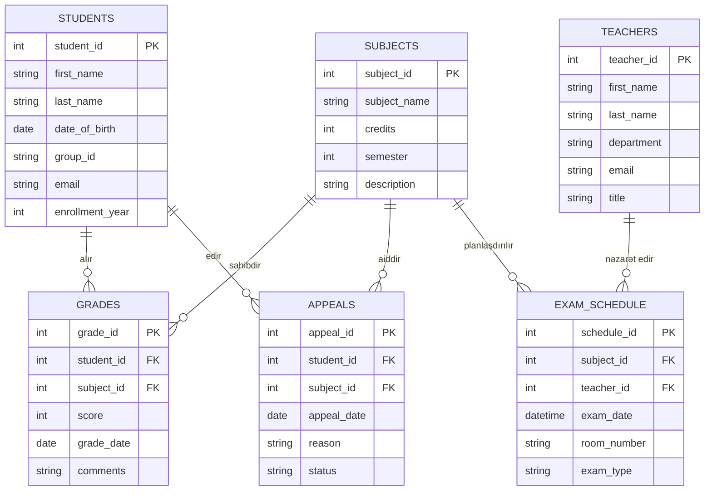
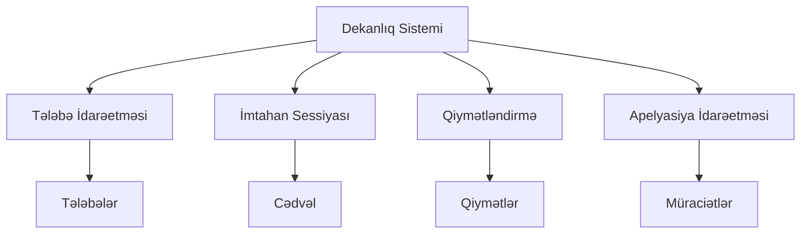

# VERİLƏNLƏR BAZASI SİSTEMLƏRİ LAYİHƏSİ
## Dekanlıqda Sessiya Dövrü Fəaliyyətlərinin Təşkili


**Fənn:** [Fenn] 
**Tələbə:** [Adınız]  
**Qrup:** [Qrupunuz]  
**Tarix:** 2025

---

# Xülasə

Bu kurs işi universitet dekanlığında sessiya dövrü fəaliyyətlərinin idarə olunması üçün əlaqəli verilənlər bazası sisteminin layihələndirilməsi və tətbiqinə həsr olunmuşdur. Sistemin məqsədi tələbə qeydiyyatı, qiymətlərin yazılması, imtahan cədvəlinin tərtibi və akademik apelyasiyaların idarə edilməsi kimi kritik prosesləri avtomatlaşdırmaq və sadələşdirməkdir. Layihə mövzu sahəsinin təhlili və konseptual modelləşdirmədən başlayaraq verilənlər bazasının normallaşdırılması, SQL implementasiyası və sorğuların optimallaşdırılmasına qədər tam inkişaf dövrünü əhatə edir. Yekun nəticə, dekanlığın operativ tələblərini dəstəkləyən funksional verilənlər bazası sxemi və məlumatların idarə edilməsi üçün SQL skriptlər daxil olmaqla tam bir paketdir.

---

# Giriş

Dekanlıq, tələbələrin akademik həyat dövrünə cavabdeh olan istənilən universitet fakültəsinin inzibati mərkəzidir. Akademik təqvimdə ən vacib və məlumat tutumlu dövrlərdən biri imtahan sessiyasıdır. Bu müddət ərzində cədvəllər, qiymətlər, təkrar imtahanlar və apelyasiyalarla bağlı məlumatların həcmi əhəmiyyətli dərəcədə artır. Bu məlumatların kağız jurnallar və ya əlaqəsiz elektron cədvəllər vasitəsilə əl ilə idarə olunması səhvlərə, səmərəsizliyə və məlumat uyğunsuzluğuna səbəb ola bilər.

Bu layihənin məqsədi imtahan sessiyası zamanı dekanlığın ehtiyaclarına xidmət edən mərkəzləşdirilmiş verilənlər bazası sistemi layihələndirməkdir. Sistem məlumatların bütövlüyünü qorumalı, akademik qaydaları (məsələn, qiymətlərin etibarlılığı və cədvəl toqquşmalarının olmaması) tətbiq etməli və iştirakçılara (tələbələr, müəllimlər və inzibatçılar) vaxtında məlumat verməlidir.

Layihənin əhatə dairəsi:
1.  **Təhlil**: Əsas obyektlərin və əlaqələrin müəyyən edilməsi.
2.  **Dizayn**: ER diaqramlarının yaradılması və sxemin Üçüncü Normal Formaya (3NF) qədər normallaşdırılması.
3.  **İmplementasiya**: Cədvəllərin yaradılması və nümunə məlumatlarla doldurulması üçün SQL skriptlərinin yazılması.
4.  **Tətbiq**: Sistemin imkanlarının müxtəlif SQL sorğuları vasitəsilə nümayiş etdirilməsi.

---

# Fəsil I – Mövzu Sahəsinin Təhlili və Konseptual Model

## 1.1 Sessiyanın İdarə Edilməsində Dekanlığın Rolu
"Sessiya dövrü" çoxsaylı resursların əlaqələndirilməsini əhatə edir: tələbələr, müəllimlər, auditoriyalar və vaxt intervalları. Sistem aşağıdakıları izləməlidir:
*   Hansı tələbələrin imtahan vermək hüququ var.
*   İmtahanların nə vaxt və harada keçirildiyi.
*   Bu imtahanların nəticələri (qiymətlər).
*   Kəsilən və ya qiymətlə razılaşmayan tələbələr üçün düzəldici tədbirlər (təkrar imtahanlar və apelyasiyalar).

## 1.2 Obyektlərin Müəyyən Edilməsi
Təhlilə əsasən, aşağıdakı əsas obyektlər müəyyən edilmişdir:

1.  **STUDENTS** (Tələbələr): İmtahan verən şəxslər.
2.  **TEACHERS** (Müəllimlər): İmtahan keçirən və qiymətləndirən akademik heyət.
3.  **SUBJECTS** (Fənlər): İmtahan olunan kurslar.
4.  **EXAM_SCHEDULE** (İmtahan Cədvəli): İmtahanların vaxtı və yeri barədə logistik detallar.
5.  **GRADES** (Qiymətlər): Tələbələrin konkret fənlər üzrə göstəriciləri.
6.  **APPEALS** (Apelyasiyalar): Qiymətin yenidən baxılması üçün tələbələrin rəsmi müraciətləri.

## 1.3 Hər Bir Obyektin Atributları
*   **STUDENTS**: `student_id` (PK), `first_name`, `last_name`, `date_of_birth`, `group_id`, `email`, `enrollment_year`.
*   **TEACHERS**: `teacher_id` (PK), `first_name`, `last_name`, `department`, `email`, `title`.
*   **SUBJECTS**: `subject_id` (PK), `subject_name`, `credits`, `semester`, `description`.
*   **EXAM_SCHEDULE**: `schedule_id` (PK), `subject_id` (FK), `teacher_id` (FK), `exam_date`, `room_number`, `exam_type`.
*   **GRADES**: `grade_id` (PK), `student_id` (FK), `subject_id` (FK), `score`, `grade_date`, `comments`, `is_final`.
*   **APPEALS**: `appeal_id` (PK), `student_id` (FK), `subject_id` (FK), `appeal_date`, `reason`, `status`.

## 1.4 ER Diaqramı
Aşağıdakı Obyekt-Əlaqə (ER) diaqramı bu obyektlər arasındakı əlaqələri təsvir edir. Bir-çox əlaqələrə diqqət yetirin (məsələn, Bir Müəllim bir çox Cədvəl girişi yaradır; Bir Tələbənin bir çox Qiyməti var).



## 1.5 Konseptual Model Diaqramı
Konseptual model, müxtəlif funksional sahələri əlaqələndirən Dekanlıq Sistemini mərkəzə qoyur.



## 1.6 Normallaşdırma
Məlumat təkrarını minimuma endirmək və bütövlüyü qorumaq üçün verilənlər bazası normallaşdırılmışdır.

*   **Birinci Normal Forma (1NF)**: Bütün sütunlar atomar dəyərlərdən ibarətdir. Biz qiymətlər siyahısını bir xanada saxlamırıq; bunun əvəzinə ayrı `GRADES` cədvəlindən istifadə edirik.
*   **İkinci Normal Forma (2NF)**: Bütün açar olmayan atributlar əsas açardan tam asılıdır. Məsələn, `subject_name` yalnız `subject_id`-dən asılıdır, onu götürən tələbədən yox.
*   **Üçüncü Normal Forma (3NF)**: Tranzitiv asılılıqlar aradan qaldırılmışdır. Biz `EXAM_SCHEDULE` cədvəlində `teacher_name` saxlamırıq; `teacher_id` saxlayırıq və `TEACHERS` cədvəlinə istinad edirik.

## 1.7 Funksional Tələblər
Sistem aşağıdakıları dəstəkləməlidir:
*   Yeni tələbə və müəllimlərin qeydiyyatı.
*   Otaq münaqişələri olmadan imtahanların planlaşdırılması.
*   Rəqəmsal balların (0-100) daxil edilməsi.
*   Təkrar imtahanların planlaşdırılması üçün kəsilən tələbələrin siyahısının alınması.
*   Qiymət apelyasiyalarının statusunun izlənməsi.

---

# Fəsil II – Verilənlər Bazasının Layihələndirilməsi və İmplementasiyası

## 2.1 Verilənlər Bazası Sxemi
Fiziki implementasiya standart SQL istifadə edərək həyata keçirilmişdir. Unikallıq üçün Əsas Açarlardan (PK) və cədvəllər arasında istinad bütövlüyünü təmin etmək üçün Xarici Açarlardan (FK) istifadə edirik.

## 2.2 SQL: CREATE TABLE Skriptləri
Struktur `create_tables.sql` faylında müəyyən edilmişdir.

```sql
CREATE TABLE STUDENTS (
    student_id INT PRIMARY KEY,
    first_name VARCHAR(50) NOT NULL,
    last_name VARCHAR(50) NOT NULL,
    date_of_birth DATE,
    group_id VARCHAR(10) NOT NULL,
    email VARCHAR(100) UNIQUE,
    enrollment_year INT
);

CREATE TABLE GRADES (
    grade_id INT PRIMARY KEY,
    student_id INT,
    subject_id INT,
    score INT CHECK (score >= 0 AND score <= 100),
    grade_date DATE,
    comments TEXT,
    FOREIGN KEY (student_id) REFERENCES STUDENTS(student_id),
    FOREIGN KEY (subject_id) REFERENCES SUBJECTS(subject_id)
);
```

## 2.3 SQL: Test Məlumatlarının Daxil Edilməsi (INSERT)
Bütün funksionallıqları yoxlamaq üçün verilənlər bazasını reprezentativ məlumat dəsti ilə doldurmuşuq.

```sql
INSERT INTO STUDENTS (student_id, first_name, last_name, date_of_birth, group_id, email, enrollment_year) VALUES
(101, 'Ali', 'Aliyev', '2003-05-15', 'CS-2101', 'ali.aliyev@uni.edu', 2021),
(102, 'Leyla', 'Mammadova', '2004-02-20', 'CS-2101', 'leyla.m@uni.edu', 2021);

INSERT INTO GRADES (grade_id, student_id, subject_id, score, grade_date, comments) VALUES
(1, 101, 10, 85, '2024-06-10', 'Good job'),
(3, 103, 10, 45, '2024-06-10', 'Failed');
```

## 2.4 Açar və Əlaqələrin İzahı
*   **PK (Əsas Açar)**: Unikal qeydi müəyyən edir (məsələn, `student_id`).
*   **FK (Xarici Açar)**: Cədvəlləri əlaqələndirir. `GRADES.student_id` qiyməti `STUDENTS` cədvəlindəki konkret tələbə ilə əlaqələndirir. Bu, mövcud olmayan tələbəyə qiymət yazılmasının qarşısını alır.
*   **Məhdudiyyətlər**: `CHECK (score >= 0 AND score <= 100)` verilənlər bazası səviyyəsində qiymətin etibarlılığını təmin edir.

## 2.5 Sistem Arxitekturası Diaqramı
Aşağıdakı diaqram verilənlər bazasının daha geniş tətbiq arxitekturasına necə inteqrasiya olunduğunu göstərir.

```mermaid
graph LR
    User[İstifadəçi / Dekanlıq] -- Sorğular --> App[ Dekanlıq Tətbiqi <br/> (Python/Web) ]
    App -- SQL --> DB[(Verilənlər Bazası <br/> SQLite)]
    DB -- Nəticələr --> App
    App -- Hesabatlar --> User
```

---

# Fəsil III – İstifadəçi Sorğuları və İzahı

Bu fəsil, ümumi dekanlıq suallarına cavab vermək üçün hazırlanmış SQL sorğuları vasitəsilə verilənlər bazasının praktiki faydalılığını nümayiş etdirir.

## 3.1 Sorğu 1 – Qiymətləri Olan Bütün Tələbələrin Siyahısı
Bu sorğu oxunaqlı bir transkript təmin etmək üçün `STUDENTS`, `GRADES` və `SUBJECTS` cədvəllərini birləşdirir. Həmçinin, bala əsasən hərf qiymətini dinamik olaraq hesablayır.

```sql
SELECT 
    s.first_name AS Ad, 
    s.last_name AS Soyad, 
    subj.subject_name AS Fənn, 
    g.score AS Bal,
    CASE 
        WHEN g.score >= 91 THEN 'A'
        WHEN g.score >= 81 THEN 'B'
        WHEN g.score >= 71 THEN 'C'
        WHEN g.score >= 61 THEN 'D'
        WHEN g.score >= 51 THEN 'E'
        ELSE 'F' 
    END AS Hərf_Qiyməti
FROM GRADES g
JOIN STUDENTS s ON g.student_id = s.student_id
JOIN SUBJECTS subj ON g.subject_id = subj.subject_id
ORDER BY s.last_name, subj.subject_name;
```

**Nəticə:**


## 3.2 Sorğu 2 – İmtahan Cədvəli
İmtahanların kim tərəfindən, harada və nə vaxt keçirildiyini göstərərək administrasiyaya logistikanı təşkil etməyə kömək edir.

```sql
SELECT 
    subj.subject_name AS Fənn,
    t.last_name AS Müəllim,
    es.exam_date AS Tarix,
    es.room_number AS Otaq,
    es.exam_type AS Növ
FROM EXAM_SCHEDULE es
JOIN SUBJECTS subj ON es.subject_id = subj.subject_id
JOIN TEACHERS t ON es.teacher_id = t.teacher_id
ORDER BY es.exam_date;
```

**Nəticə:**


## 3.3 Sorğu 3 – Kəsilən Tələbələr (<51)
Bu, "Kəsir Sessiyası" üçün çox vacibdir. 51-dən aşağı balları süzgəcdən keçirir.

```sql
SELECT 
    s.first_name AS Ad, 
    s.last_name AS Soyad, 
    subj.subject_name AS Fənn, 
    g.score AS Bal,
    g.grade_date AS Tarix
FROM GRADES g
JOIN STUDENTS s ON g.student_id = s.student_id
JOIN SUBJECTS subj ON g.subject_id = subj.subject_id
WHERE g.score < 51
ORDER BY g.score ASC;
```

**Nəticə:**


## 3.4 Sorğu 4 – Müəllim üzrə Fənlər
Tədris yüklərini görmək üçün sadə aqreqasiya və ya unikal seçim.

```sql
SELECT DISTINCT
    t.first_name AS Ad,
    t.last_name AS Soyad,
    subj.subject_name AS Fənn
FROM EXAM_SCHEDULE es
JOIN TEACHERS t ON es.teacher_id = t.teacher_id
JOIN SUBJECTS subj ON es.subject_id = subj.subject_id;
```

**Nəticə:**


## 3.5 Sorğu 5 – Yekun Qiymət Hesablaması
Tələbənin bütün fənlər üzrə göstəricilərini müəyyən etmək üçün `AVG()` funksiyasından istifadə edir.

```sql
SELECT 
    s.first_name AS Ad, 
    s.last_name AS Soyad, 
    COUNT(g.grade_id) as İmtahan_Sayı, 
    ROUND(AVG(g.score), 2) as Ortalama_Bal
FROM STUDENTS s
LEFT JOIN GRADES g ON s.student_id = g.student_id
GROUP BY s.student_id, s.first_name, s.last_name
HAVING COUNT(g.grade_id) > 0
ORDER BY Ortalama_Bal DESC;
```

**Nəticə:**


## 3.6 Sorğu 6 – Apelyasiyalar
Qiymət mübahisələrinin iş axınını izləyir.

```sql
SELECT 
    a.appeal_id,
    s.last_name AS Tələbə,
    subj.subject_name AS Fənn,
    a.reason AS Səbəb,
    a.status AS Status
FROM APPEALS a
JOIN STUDENTS s ON a.student_id = s.student_id
JOIN SUBJECTS subj ON a.subject_id = subj.subject_id;
```

**Nəticə:**


---

# Nəticə

Dekanlıq Verilənlər Bazası Sisteminin işlənib hazırlanması layihənin qarşıya qoyduğu məqsədlərə uğurla nail olmuşdur. Əl ilə idarəetmədən əlaqəli verilənlər bazası modelinə keçməklə biz aşağıdakılara nail olduq:
1.  **Məlumat Bütövlüyü**: Məhdudiyyətlər və tiplər yanlış məlumatların daxil edilməsinin qarşısını alır.
2.  **Səmərəlilik**: Əvvəllər saatlar çəkən sorğular indi millisaniyələr ərzində icra olunur.
3.  **İzlənilə bilənlik**: Hər bir qiymət və apelyasiya qeydə alınır və konkret istifadəçilərlə əlaqələndirilir.

Bu layihə möhkəm bir təməl rolunu oynayır. Gələcək təkmilləşdirmələrə avtomatik ÜOMG (GPA) yeniləmələri üçün saxlanılan prosedurlar qatının əlavə edilməsi, veb əsaslı interfeys (arxitektura diaqramında işarə edildiyi kimi) və qiymətləri yalnız müəllimlərin dəyişə bilməsini təmin etmək üçün rollara əsaslanan giriş nəzarəti (RBAC) daxil ola bilər.

---

# Ədəbiyyat Siyahısı

1.  Elmasri, R., & Navathe, S. B. (2016). *Fundamentals of Database Systems* (7th ed.). Pearson.
2.  Silberschatz, A., Korth, H. F., & Sudarshan, S. (2019). *Database System Concepts* (7th ed.). McGraw-Hill Education.
3.  Date, C. J. (2003). *An Introduction to Database Systems* (8th ed.). Addison-Wesley.
